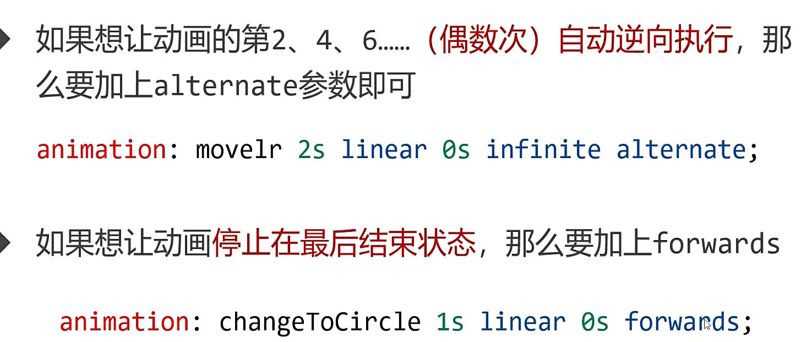

## HTML5 语法特性

### 空白折叠 ：

1. 文字和文字之间的多个空格、换行被折叠成一个空格
2. 标签“内壁”和文字之间的空格会被忽略

### 转义字符：

` &lt; 小于号 &gt; 大于号 &nbsp; 空格 &copy; 版权符号©`

## 网页关键词和页面描述

### meta：表示网页的基础配置，charset：字符集

` <meta name="Description" content="网页内容介绍：充电5分钟，通话两小时">`

` <meta name="Keywords" contnet="手机，5G手机，游戏手机">`

` <meta charset="UTF-8">`

## 列表

### `<ol type="i">` type: i o a A

### `<ol status="3" reversed>` reversed:反转

## 过渡和动画

### 从 IE10 开始兼容，所有数值类型属性都可以参与过渡

### ` transition:width 1s linear 0s;` 过渡属性、持续时间、速度曲线类型、延迟时间

> linear:匀速、ease：先快后满、ease-in：、ease-out、ease-in-out

### `/* 保留box里面3d效果 */    transform-style: preserve-3d;`

### `transform-oragin:原点 `

### ` animation: r 1s linear 0s 3;` 动画名、持续时间、速度曲线、延迟时间、执行次数（infinite 无限执行）

### 
