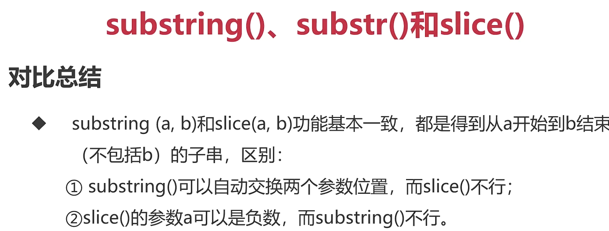

## JavaScript

### 变量提升

- 变量声明的提升：你可以提前适应一个稍后才声明的变量，而不会引发异常
- 实际开发时，不要可以使用变量声明提升

```
console.log(a) // undefine
var a = 12
console.log(a) // 12
```

### 前端开发主要有那些层？语言和功能是什么？

> 主要有 3 层：结构层（html，搭建页面框架）、样式层（css，美化页面）、行为层（javaScript，添加交互效果）

### JavaScript 的书写位置在哪里？

> 在 html 中（除 node），使用 script 标签对，或外置 javascript 文件，使用 script>src 引入

### JavaScript 输出语句

> alert(),console.log(),

### 变量是什么？如何定义变量？变量的合法命名规则？

> 变量是存储值的容器不是值本身，使用 var（let，const），使用数字、字母、下划线（数字不能开头），变量名不能是关键字

## JavaScript 中两大数据类型

### 基本数据类型：Number、String、Boolean、Undefined、Null

### 复杂数据类型： Object、Array、Fuction、RegExp、Date、Map、Set 等

### typedef 运算符


```
typedef 5; // number
typedef 'hhh'; // string
typedef null; // object
```

### 1.Number

- 所有数字不分大小、不分整浮、不分正负，都是数字类型

#### 科学计数法

` 3e8; //300000000`
`3e-4; //0.0003 `

#### 不同进制

` 0b10 //二进制`
` 017  //八进制`
` 0xf  //十六进制`

#### NaN 是一个值，typedef NaN; //number,'hhh'-'ada'

### 2.String

```
'abc'+'def'; //'abcdef'
var year = 2024
var str = 'hello '+year+'!'; // 'hello 2024!'
```

#### 空字符串

` var str = '';`

#### length 属性

` 'ggg'.length; //3`

#### 常用方法


```
  let str = 'ABCDEFGhijk'
  for(let i=0;i<str.length;i++)
    console.log(str.charAt(i)+''+str[i]);
  console.log(str.substring(1,5));//BCDE,subString(a,b)获得从a开始到b‘结束不包括b的字符串
  console.log(str.substr(1,5));// BCDEF,substr(a,b)中的a可以为负数
  console.log(str.slice(1));//BCDEFGHIJK，sclie(a,b)获得从a开始到b结束不包括b的字符串,参数a可以为负数，a必须小于b
  console.log(str.toUpperCase()+' '+str.toLowerCase());//ABCDEFGHIJK abcdefghijk
  console.log('hhhjkjhhh'.indexOf('j'));
```



### 3.Boolean 类型

- 布尔值只有 true 和 false

### 4.undefind

- 一个只定义没有被赋值的变量默认值是 undefined
- undefined 既是值又是一种类型

### 5.null 类型

- null 表示空，它是空对象
- 我们需要将对象销毁、数组或者删除时间监听是，通常设置为 null
- typedef null; // object

### 6.数据类型转换

#### 6.1 使用 Number()函数

```
Number('123'); // 123
Number('123.4'); // 123.4
Number('234年末'); // NaN，有其他英文中文字符都会转为NaN
Number(''); // 0
Number(false); // 0
Number(true); // 1
Number(undefined); // NaN
Number(null); // 0
Number('1+1'); // NaN
```

#### 6.2 使用 parseInt()函数

- parseInt()将自动截掉第一个非数字字符之后的所有字符

```
parseInt('3.14'); // 3
parseInt('3.14是圆周率'); // 3
parseInt('圆周率3.14'); // NaN
```

#### 6.2 使用 parseFloat()函数

- parseFloat()将字符串转为浮点数

```
parseFloat('3.14'); // 3.14
parseFloat('3.14是圆周率'); // 3.14
parseFloat('圆周率3.14'); // NaN
parseFlost(true); // NaN，true在转换时变成了'true'
```

#### 6.3 使用 String()函数

```
String(123); // '123'
String(123.25); // '123.25'
String(NaN); // 'NaN'
String(0xf); // '15'，其他进制会先转为十进制
```

#### 6.4 使用 toString()函数，常用

```
let a = 6
a.toString(); // '6'
```

### 6.5 使用 Boolean 函数

```
Boolean(123); // true
Boolean('false'); // true
Boolean(0); // false
Boolean(''); // false
Boolean(undefined); // false
Boolean(NaN); // false
Boolean(null); // false
```

### 7.复杂数据类型

- [1,2,3] {a:1,b:3} function(){}
- 复杂数据类型都是引用类型

### 8.总结

```
0 / 0 // NaN
4 / 0 // Infinity
```
