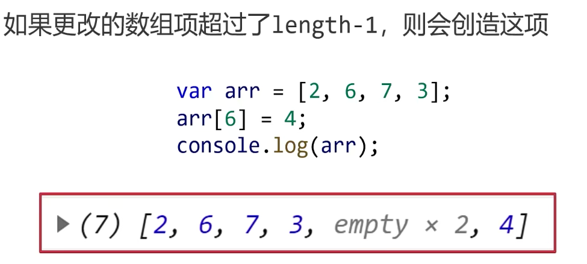
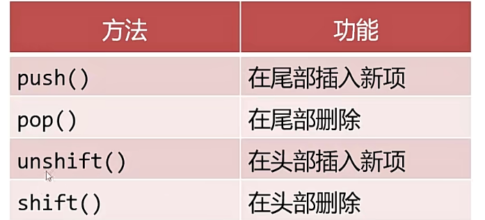
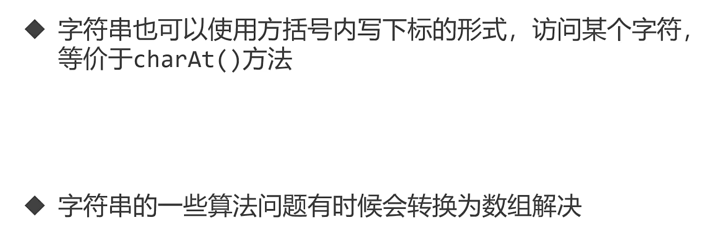
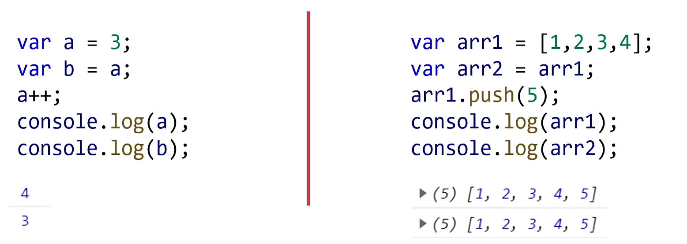
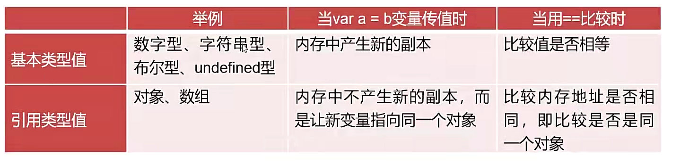

## 数组

### 什么是数组

> 顾名思义，用来存储一组相关的值，方便求和、遍历等

### 定义数组

` var arr = ['A','B','C'];`

` var arr = new Array('A','B','C');`

` var arr = new Array(4);`

### 访问数组项

- 数组的下标从 0 开始
  ` console.log(arr[0])`

#### 下标越界：访问数组中不存在的项会返回 undefined，不会报错

### 数组长度 ` arr.length`

### 更改数组项



### 数组的遍历

```
var arr = ['A','B','C','D'];
for(var i = 0;i < arr.lenth; i++){
  console.log(arr[i]);
}
```

### 数组类型的检测

- 数组用 typedef 检测结果是 object
- Array.isArray()方法可以检测数组，返回布尔类型

### 数组的常用方法

#### 数组的头尾操作方法



```
var arr = [1,2,3,4,5]
arr.push(6)
console.log(arr);// [1, 2, 3, 4, 5, 6]
arr.pop()
console.log(arr);// [1, 2, 3, 4, 5]
arr.unshift(0)
console.log(arr);// [0, 1, 2, 3, 4, 5]
arr.shift()
console.log(arr);//[1, 2, 3, 4, 5]
```

#### 数组的 splie()方法

- 可以用于替换和删除数组元素

- splie()会返回被删除的数组项

```
var arr = [1,2,3,4,5]
arr.splice(1,2,'X','Y','Z'); //从下标3开始，删除2个元素，然后插入所有的item。
console.log(arr); // [1, 'X', 'Y', 'Z', 4, 5]
```

#### slice()方法

```
var arr = [1,2,3,4,5]
console.log(arr.slice(0,3)); //[1, 2, 3],返回子数组，以arr[0]开头，以arr[3]前一个元素结尾。
```

#### join()和 split()方法

- join()方法是数组转化为字符串，参数表示以什么字符作为分隔，留空默认都好（和 toString()方法一样）
- split()方法是字符串转为数组，参数一般不留空,以参数进行拆分，''默认把每个字符拆分

```
var arr = [1,2,3,4,5]
var str = "hello"
console.log(arr.join(),str.split('')); // 1,2,3,4,5 ['h','e','l','l','o']
```



#### concat()方法

- concat()方法可以合并连接多个数组
- concat()方法不会改变原数组

```
var arr = [1,2,3,4,5]
var str = "hello"
console.log(arr.concat(str.split(''))); // [1, 2, 3, 4, 5, 'h', 'e', 'l', 'l', 'o']
```

#### reverse()方法

- reverse()方法将数组反转

```
var str = 'hello'
var strReaverse = str.split('').reverse().join(''); // olleh
```

#### indexOf()和 includes()方法

- indexOf()方法功能是搜索数组中的元素，并返回它所在的位置，如果元素不存在，返回-1
- includes()方法的功能是判断一个数组是否包含一个指定的值，返回布尔值

```
var arr = [1,2,3,4,5]
console.log(arr.indexOf(3),arr.includes(2)); // 2 true
```

#### sort()

- sort()方法可以用于数组排序

### 遍历相关算法

#### 数组去重

```
var  arr = [1,1,1,4,4,2,1,3,3]
var arr2 = []
for(var i=0;i<arr.length;i++){
  if(arr2.includes(arr[i]))continue;
  arr2.push(arr[i]);
}
console.log(arr2); // [1, 4, 2, 3]
```

#### 冒泡排序

```
var arr = [9,6,2,3]
for(var i=0;i<arr.length-1;i++){
  var x = i
  for(var j=i+1;j<arr.length;j++){
    if(arr[j]<arr[x]){
      x = j;
    }
  }
  var num = arr[i]
  arr[i] = arr[x];
  arr[x] = num
}
console.log(arr);
```

### 二维数组

```
 var arr =[
  [1,2,3],
  [4,5,7],
  [8,9,10]
];
arr[0][0] // 1
arr[1][1] // 5
```

### 引用类型



- 基本类型：number、boolean、null、undefined、string
- 引用类型：array、object、function、regexp
  > 值（基本）类型和引用类型的区别是，值类型赋的变量直接存储数据，引用类型的变量存储数据的引用。
  > 

### 深克隆和浅克隆

- 浅克隆：只克隆数组的第一层，如果是多维数组，或者数组中的项时其他引用类型，则不克隆其他层。
- 深克隆：克隆数组的所有曾，要使用递归技术，像 lodash 库

```
var arr = [9,6,2,3,[4,5]]
var arr2 = [].concat(arr)
console.log(arr2,arr2==arr,arr2[4]==arr[4]); // [9,6,2,3] fase true(藕断丝连)
var arr3 = []
for(var i = 0;i<arr.length;i++)
  arr3[i]=arr[i]
console.log(arr3,arr3==arr); // [9,6,2,3] fase true(藕断丝连)
```

### 总结
