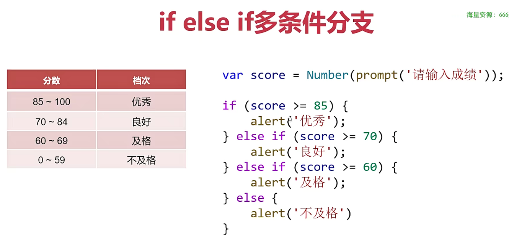
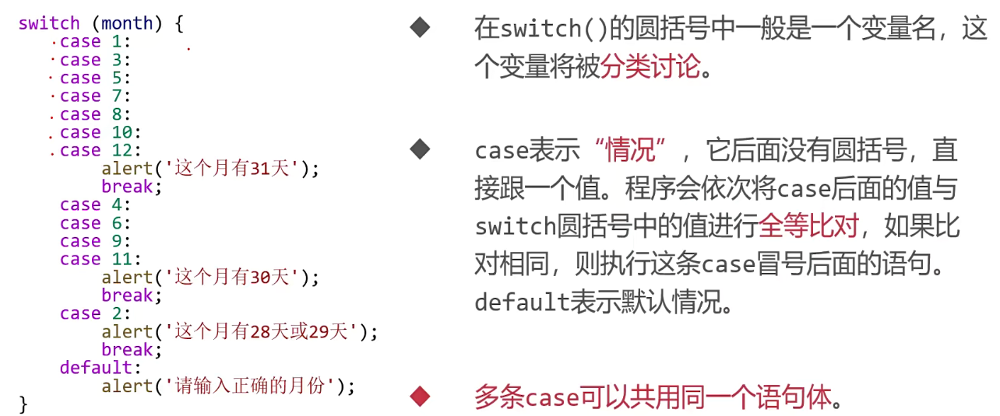
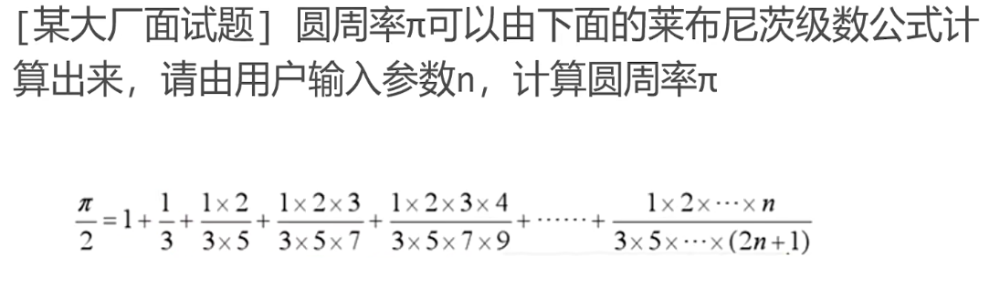
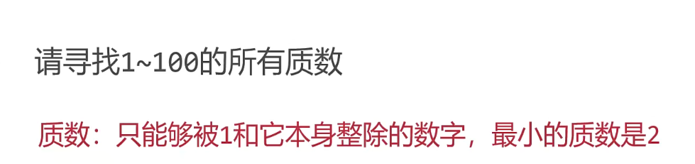

## 条件语句

### if 语句



### swith 语句



### 三元运算符


## 循环语句

### for 循环语句

```
for(var i = 1; i <=10 ; i++){
    console.log(i);
  }
```

### while 循环语句

```
var i=1;
while(i<=100){
  console.log(i);
  i++;
}

```

### break 和 continue

- break 表示立即终止循环，它只能在循环语句中，在 for 循环和 while 中都可以使用
- continue 用于跳过循环的一个迭代，并执行循环中的下一个迭代

### do-while

```
var n = 1,sum = 0;
  do{
    sum += n;
    n ++;
  }while(n<=100)
  console.log(sum);
```

## 初识算法

### 随机数函数

> Math.random() //得到 0 到 1 之间的小数

> parseInt(Math.random()\*(b-a+1))+a //得到 a 到 b 之间的整数

```
// 水仙花数：它的每个数位的数字的立方和等于它本身
  var n = Number(prompt('情输入一个三位数字'))
  var a = n % 10;
  var b = parseInt(n /10 % 10);
  var c = parseInt(n / 100);
  console.log(`百位:${c},十位:${b},个位:${a}`);
  console.log(Math.pow(a,3) + Math.pow(b,3) + Math.pow(c,3));
  if(Math.pow(a,3) + Math.pow(b,3) + Math.pow(c,3) === n)
    alert(n+'是水仙花数');
  else alert(n+'不是水仙花数');

// 计算1+2+3+……+100的和
  var sum=0;
  for(var i = 1; i <= 100; i++)sum+=i;
  console.log(sum);
    //猜数字小游戏
  var x = parseInt(Math.random()*98)+2;
  console.log(x);
  var n = 0;
  while(n !== x){
    n = Number(prompt('请输入数字'));
    if(n > x)alert('输入的数字太大了');
    else if(n < x)alert('输入的数字太小了')
  }
  alert('猜对了！')
```

### 什么是算法



```
var n = Number(prompt('请输入数字'));
var x=1;
var sum = 1;
for(var i = 1;i <= n; i++){
  x*=i/(i*2+1);
  console.log(x);
  sum += x;
}
console.log(sum*2);

```



```
for(var i=2;i<=100;i++){
  var bl = true;
  for(var j=2;j<i;j++){
    if( i % j ===0){
      bl = false;
      break;
    }
  }
  if(bl)console.log(i);
}
```
