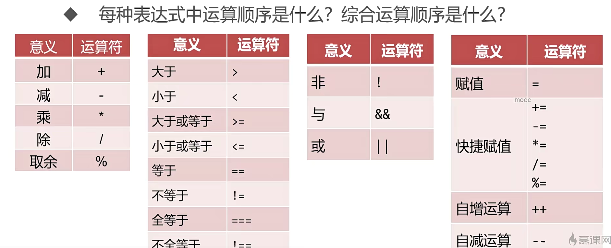
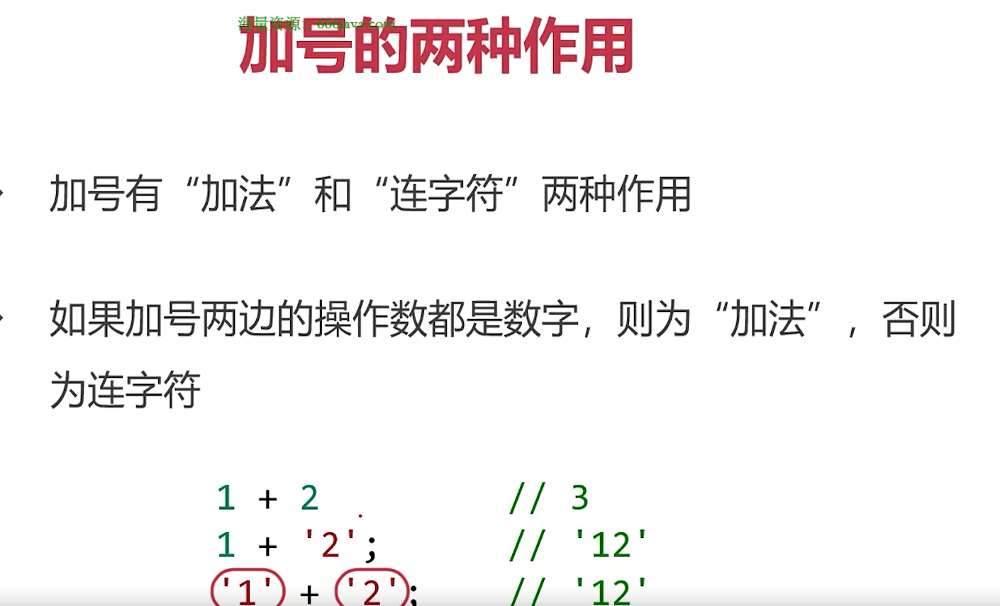
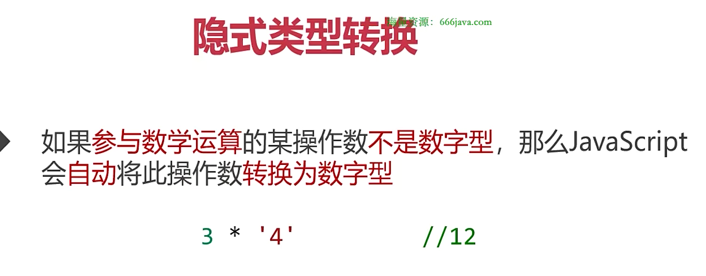
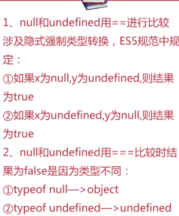

## 表达式和运算符

### 算数运算符




#### 隐式类型转换，本质调用 Number()



#### 有关 IEEE754

- 在 javaScript，有些小鼠的数字运输不是很标准
  ` 0.1 + 0.2  // 0.300000000000004`
- javaScript 使用了 IEEE754 二进制浮点数算数标注，使得个别小鼠运算丢失精度
- 解决办法，在进行小数运算时，调用 toFixed()方法保留指定小数位数

#### 幂和开根号

```
Math.pow(2,3) // 8
Math.pow(3,2) // 9
Math.sqrt(81) // 9
Math.sqrt(-81) // NaN
```

#### 向上取整和向下取整

```
Math.ceil(8.2) // 9
Math.floor(8.6) // 8
```

### 相等和全等

- NaN 不自等，isNaN()函数可以判断变量值是否为 NaN（使用的 Number()）



### 不相等和不全等

```
5 != 6 //true
5 !== 6 //true
5 != '5' //false
5 !== '5' //true
```

### 短路计算

```
a && b // a真，表达式值为b，a假表达式值为a
```

### 赋值运算符

- =表示赋值，==判断是否相等，===判断是否全等
- a++和++a，先加再用和先用再加
