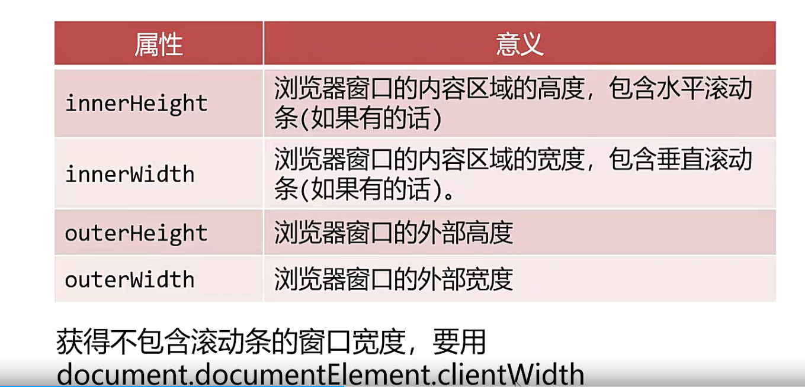
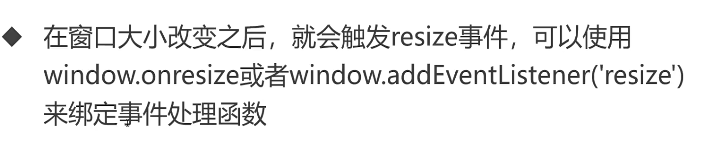
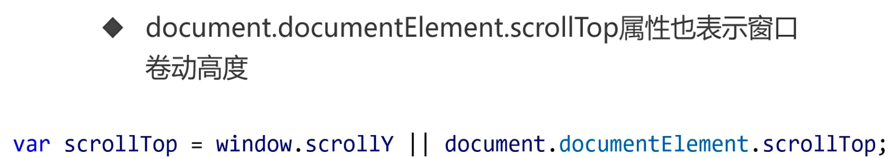
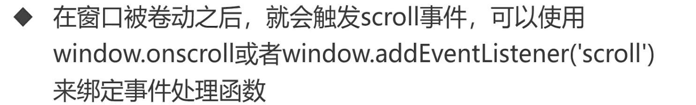
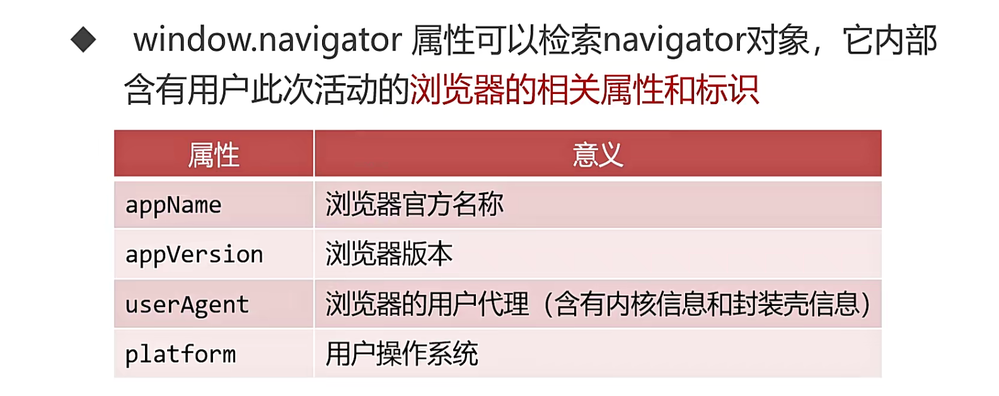
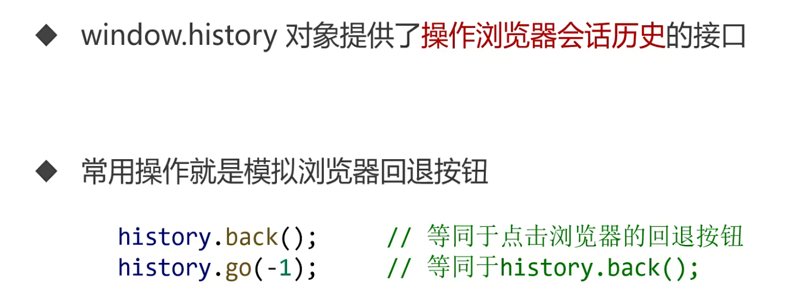
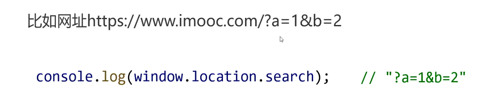

## BOM 浏览器对象模型

### window 对象

- window 对象时 js 脚本运行所处的窗口，这个窗口包含 document 属性，window.document 就是 document 对象

- 内置函数普遍是 window 的方法，`window.hasOwnProperty()`查看 window 有哪些属性

#### 窗口属性相关属性

- resize 事件

- scroll 事件

### Navigator 对象

### History

### Location

- 跳转页面`window.location="",winduo.location.href=""`
- `window.location.reload(true)`重新加载当前页面，参数为 true 表示从服务器强制加载
- `window.location.search`属性即为当前浏览器的 GET 请求查询参数

