## dom

- dom 文档对象模型：是 javaScript 操作 HTML 文档的接口，使文档操作便的优雅简洁

### 如何改变元素节点的内容

1. innerHTML：以 HTML 语法设置节点内容
2. innerText：以纯文本的形式设置节点中的内容

```
var box = document.getElementsByClassName('box')[0];
// box.innerHTML = `
//   <ul>
//     <li>hhh</li>
//     <li>ggg</li>
//   </ul>
// `
box.innerText = 'hhh'
```

#### 节点的创建和克隆

`document.createElement()`

> 创建出来的节点是”孤儿节点“，必须继续使用`appendChild()`或`insertBefore()`及那个节点插入到 dom 树上

- `父节点.appendChild(孤儿节点)`:将孤儿节点挂载到最后一个子节点
- `父节点.insertBefore(孤儿节点,标杆节点)`:将孤儿节点挂载到”标杆节点“之前的节点
- `removeChild(节点)移除节点`
- `cloneNode()克隆节点，克隆出的节点是孤儿节点，cloneNode(true):深度克隆`

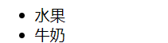

```
var box = document.getElementsByClassName('box')[0];
var ul = document.createElement('ul');
var muilk = document.createElement('li');
muilk.innerText = "牛奶";
ul.appendChild(muilk);
var fruits = document.createElement('li');
fruits.innerText = "水果";
ul.insertBefore(fruits,muils);
box.appendChild(ul);
```

- 20 行 20 列的表格

```
var table = document.getElementById('mytable');
for(var i=0;i<20;i++){
  var tr = document.createElement('tr');
  for(var j=0;j<20;j++){
    var td = document.createElement('td');
    tr.appendChild(td);
  }
  table.appendChild(tr)
}
```

#### 改变节点的 css 样式

- `node.style.bagroundColor = 'red';`

#### 改变元素阶段的 html 属性

- `oImg.src = 'images/2.jpg'` 标准 W3C 属性，如 src、href 等，只需要直接打点进行更改
- `node.setAttribute('data-n',10)`自己设置属性,`getAttribute('data-n')获取属性`

#### nodeType 常用属性

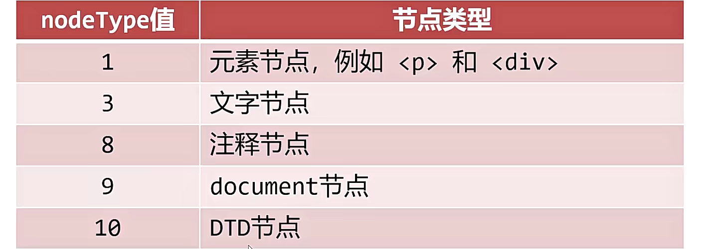

### 访问元素节点

- 几乎所有的 DOM 功能都封装在了 document 对象中，包括整个 HTML 文档

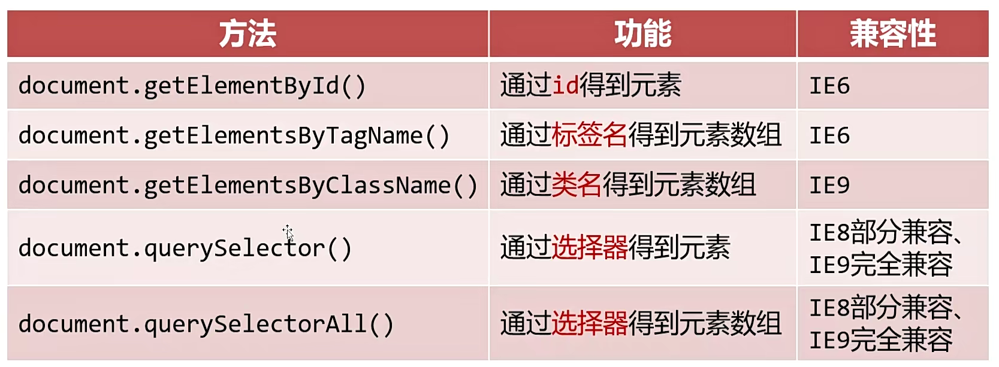
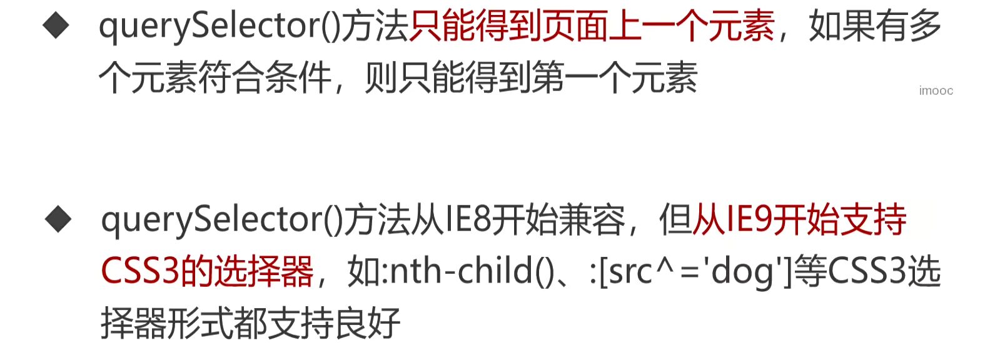

### 延迟运行

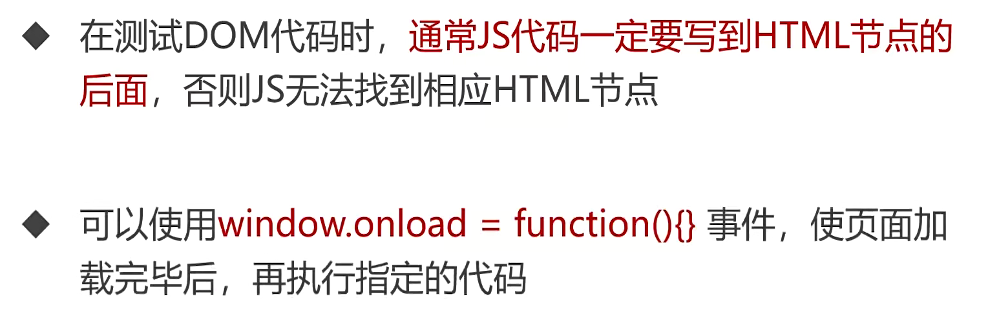

### 节点的关系

- 父节点可以使用`firstChile`和`lastChild`、`childNode`获取子节点
- 文本节点也属于节点

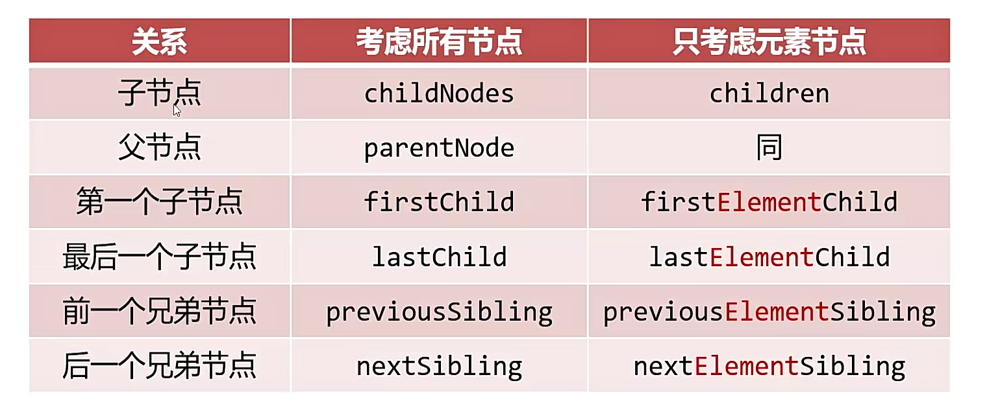

### dom 事件

#### 事件监听

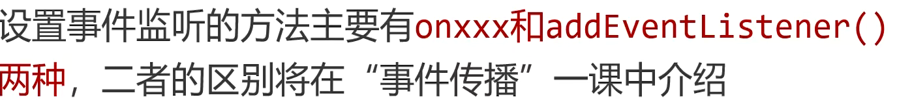
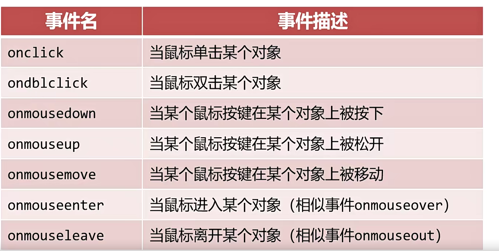
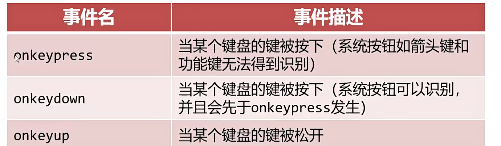
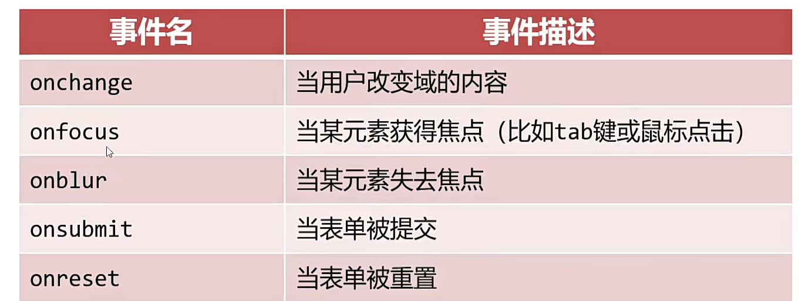

- `oninput()`输入事件
- `onload()`当页面或图像被完成加载
- `onunload()`当用户退出页面

#### 事件监听顺序

- 事件的传播：先从外到内，再从内到外
- onxxx（DOM0 级） 这种只能监听冒泡阶段
- DOM2 级事件监听`addEventListener('click',fun(){},true);`true 监听捕获，false 监听冒泡
- 最内部的元素不再区分捕获和冒泡阶段，会先执行写在前面的监听
- 如果给元素设置相同的多个事件，DOM0 后面的覆盖前面的，DOM2 按顺序执行

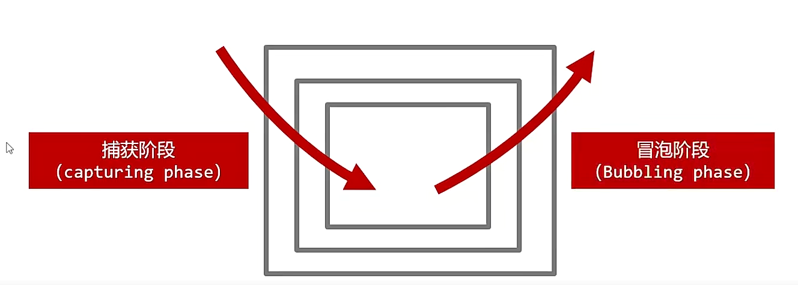

#### 事件对象

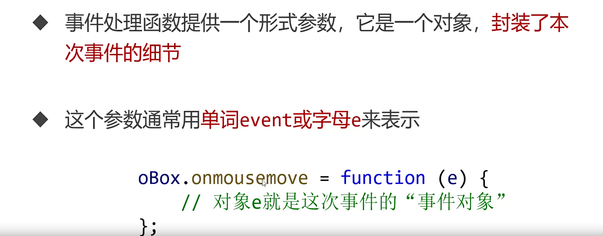
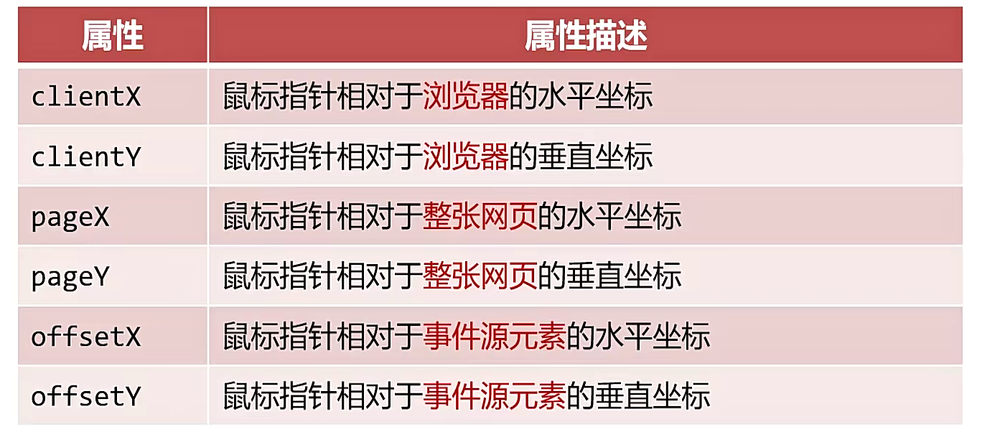

- `e.charCode：在onkeypress中和e.keyCode在onkeyup和onkeydown中`
- charCode 字符码
  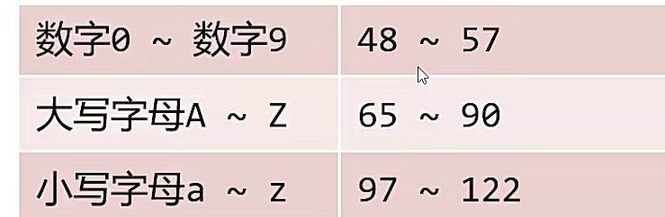
- keyCode 键码
  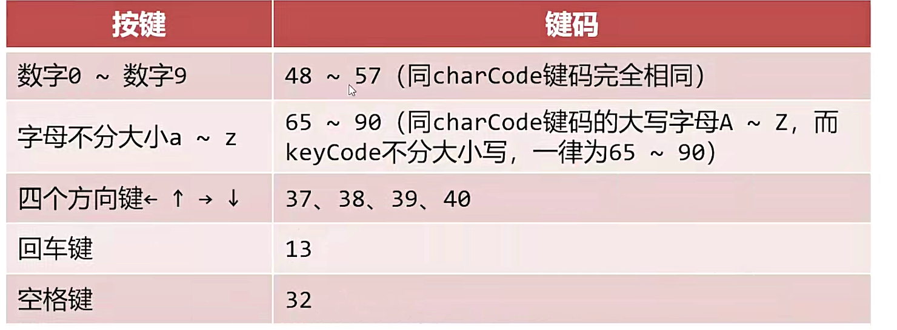

```
  var box = document.querySelector('#box');
  var l = 200;
  var t = 200;
  document.onkeydown = function(e){
    box.innerHTML = `x:${t} y:${l}`;
    switch(e.keyCode){
      case 37:
        l -= 3;
        break;
      case 38:
        t -= 3;
        break;
      case 39:
        l += 3;
        break;
      case 40:
        t += 3;
        break;
    }
    box.style.left = l+'px';
    box.style.top = t+'px';
  }
```

- `e.preventDefault()`阻止默认事件
- `onmousewheel`鼠标滚轮事件，e 提供 deltaY 表示鼠标方向，向下滚动返回正值，向上滚动返回负值`
- `e.stopPropagation()`停止事件传播（捕获和冒泡）

### 事件委托

#### 批量添加事件监听

- 批量事件监听内存消耗非常大

```
  var li = document.querySelectorAll('li');
  console.log(li);
  for(var i = 0;i < li.length; i++){
    li[i].onclick = function(){
      this.style.color = 'red';
    };
  }
```

- 利用事件冒泡机制，将后代元素事件委托给祖先元素
- 使用冒泡添加事件监听
- `e.target`触发事件的最早元素，即事件源元素和`e.currrentTarget`事件处理程序附加到的元素

```
 <ul>
  <li>1</li>
  <li>2</li>
  <li>3</li>
  <li>4</li>
  <li>5</li>
  <li>6</li>
  <li>7</li>
  <li>8</li>
  <li>9</li>
```

```
  var li = document.querySelectorAll('li');
  var ul = document.querySelector('ul');
  var OBtn = document.querySelector('.btn');
  OBtn.onclick = function (e){
    var newLi = document.createElement('li');
    newLi.innerText = 'new';
    ul.appendChild(newLi);
  }
  ul.onclick = function(e){
    console.log(e.target,e.currentTarget);
    e.target.style.color = 'red';
  }

```

> onmouseenter 天生不冒泡，onmouseover 会冒泡

- 事件委托注意事项：最内层元素不能再有额外的内层元素了，不要委托给不冒泡的祖先元素

### DOM 属性都有 offsetTop 属性，表示此元素到定位祖先元素的垂直距离

- 祖先元素，离自己最近的拥有定位元素的祖先元素
