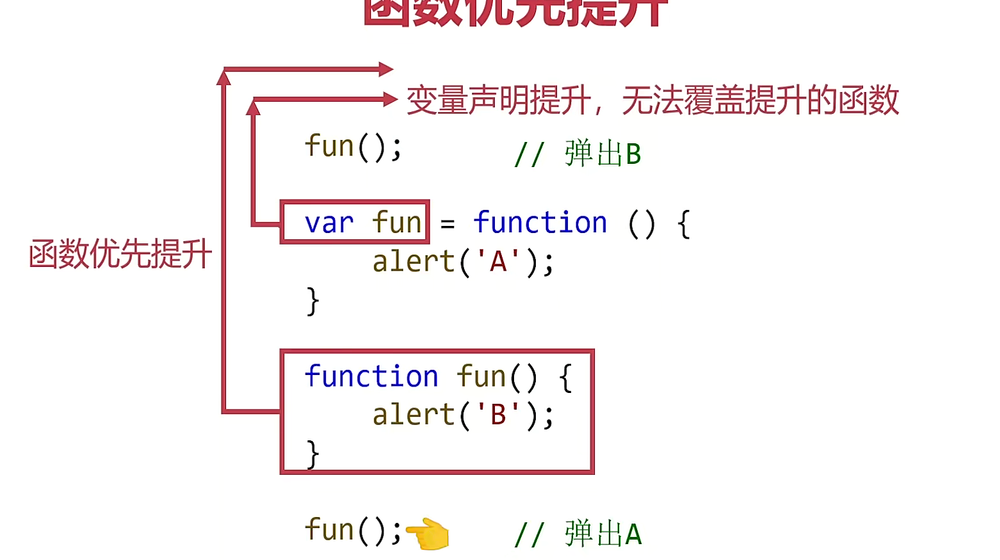
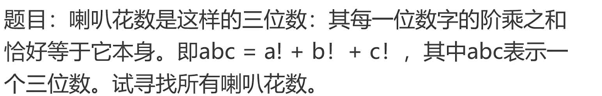
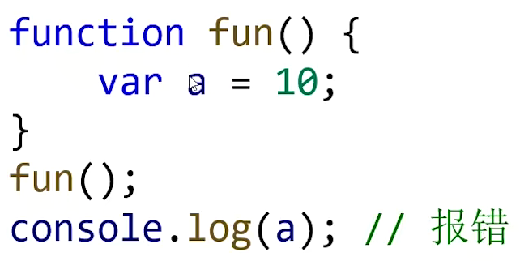
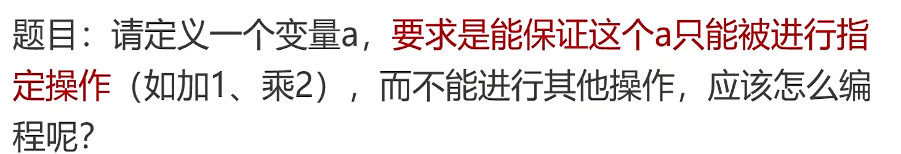
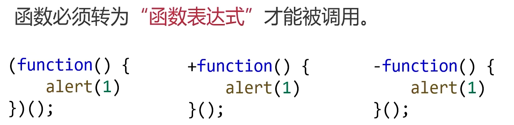
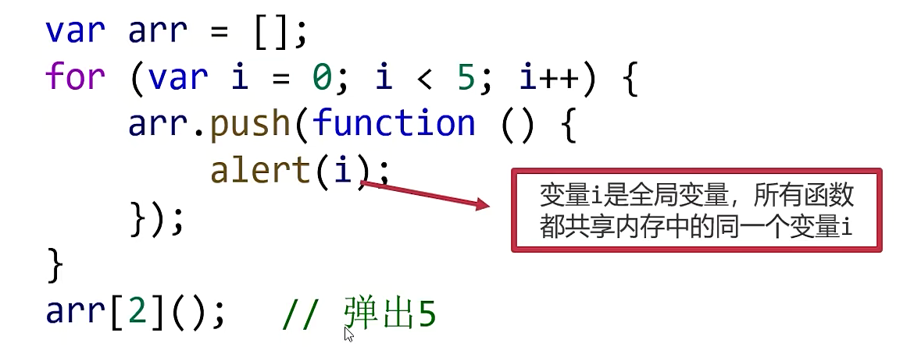
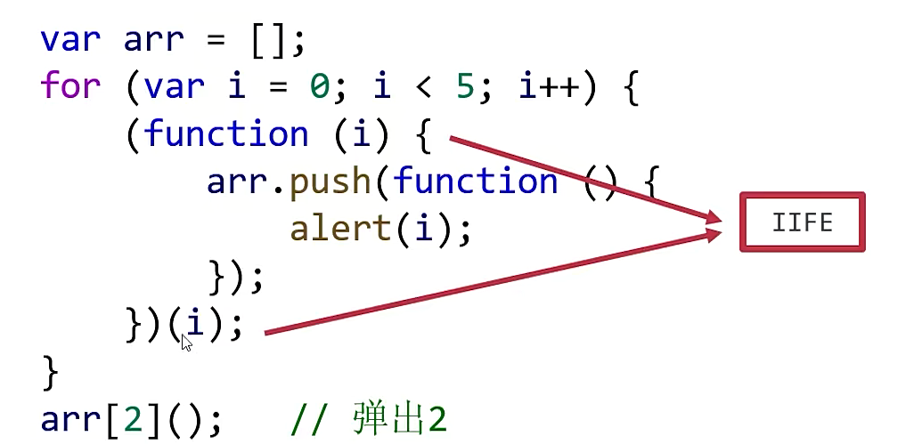

## 函数

- 什么是函数：函数就是语句的封装，可以让这些代码方便地被使用，
- 具有一次定义，多次调用的优点
- 函数使代码更具有可读性

### 函数的定义和调用

- 函数必需先定义再使用
- 函数声明的提升
- 函数表达式不能提升
- 函数优先提升>变量提升，变量只提升定义不提升值，所以后面的函数表达式不会覆盖函数定义
  

```
// 定义函数
function fun(){
  // 函数语句
}
// 函数表达式
var fun = function (){
  // 函数体语句
}
fun(); // 调用函数

function fun(params) {
  console.log(params);
}
fun('hello!');
```

### 函数的参数和返回值

- 形参和实参
- arguments 类数组对象，所有属性均从 0 开始的自然数序列，并且有 length 属性，和数组类似可以用方括号书写下标访问对象的某个属性值，但不能调用数组的方法
- 遇见 return 立即退出函数

```
function add(a,b){
  return a+b
}
console.log(fun(1+2)); // 3
```

### 函数算法题



```
 function jc(num){
    var res = 1;
    for(var i = num; i >=1 ;i --){
      res *= i;
    }
    return res;
  }
  function fun() {
    for(var i=100;i<1000;i++){
      var sum = 0;
      for(var j=0;j<3;j++){
        var x = Number(i.toString()[j]);
        // console.log(x);
        sum += jc(x);
      }
      if(i===sum)console.log(i);
    }
  }
  fun(); // 145
```

- sort()方法使用

```
var arr = [33,22,55,11];
// a、b时数组靠前的项和靠后的项，如果需要将它们交换位置，则返回任意正数，否则返回负数
arr.sort(function(a,b){
  return a-b; // 从小到大
});
console.log(arr); // [11, 22, 33, 55]
```

### 递归

- 求阶乘

```
function fn(n){
  if(n==1)return 1;
  return n*fn(n-1);
}
console.log(fn(4)); // 24
```

- 斐波那契数列

```
var a = [1,1]
function fn(n){
  if(n==1||n==0)return 1;
  if(!a[n])a[n]=fn(n-1)+fn(n-2);
  return a[n];
}
var sum=0;
// 求前15项
fn(15);
for(var i=0;i<15;i++){
  console.log(a[i]);
  sum+=a[i];
}
console.log(sum); // 1596
```

#### 实现深克隆

```
var a = [1,2,3,[4,5,6,[7,8]]];
function fn(arr){
  var b = [];
  for(var i=0;i<arr.length;i++){
    if(Array.isArray(arr[i])){
      b.push(fn(arr[i]));
    }else{
      brr.push(arr[i]);
    }
  }
  return b;
}
var b = fn(a);
console.log(b);
```

### 变量作用域

- js 有三种作用域：全局作用域、函数作用域和块级作用域（es6）。

- javaScript 是函数级作用域变成语言：变量制作器定义时所在的 function 内部有意义。
  

#### 全局变量

- 直接编写在 script 标签之中的 JS 代码，或者是一个单独的 JS 文件中的，都是全局作用域。全局作用域在页面打开时创建，页面关闭时销毁。在全局作用域中有一个全局对象 window（代表的是一个浏览器的窗口，由浏览器创建），可以直接使用。

#### 遮蔽效应

- 如果函数也定义了和全局同名的变量，则函数内的变量会将全局的变量“遮蔽”
- 变量声明提升

```
var a = 10;
function fn(){
  a++; //下面的局部变量进行了变量声明提升，但只提升了定义，所以a没有++
  var = 5;
  console.log(a); // 5
}
fn();
console.log(a); // 10
```

#### 形参也是局部变量

#### 作用域链

- 函数的嵌套：一个函数内部也可以定义一个函数，与局部变量类似，定义在一个函数内部的函数是局部函数。
- 在函数嵌套中，变量会从内到外逐层寻找它的定义

#### 不加 var 将定义全局变量

- 初次给变量赋值时，如果没有加 var，将定义全局变量。

### 闭包

- 什么是闭包：闭包时函数本身和该函数声明时所处的环境的结合
- 闭包的功能：记忆性、模拟私有变量
  

1. 什么是闭包？函数和函数内部能访问到的变量的总和，就是一个闭包。
2. 如何生成闭包? 函数嵌套 + 内部函数被引用。
3. 闭包作用？隐藏变量，避免放在全局有被篡改的风险。
4. 使用闭包的注意事项？不用的时候解除引用，避免不必要的内存占用。
5. 闭包的缺点：使用时候不注意的话，容易产生内存泄漏(内存泄漏指程序中已分配的内存由于某种原因未释放或无法释放)。

```
function createCheckTemp(standardTemp){
  return function checkTemp(n){
    if(n<=standardTemp)alert('体温正常');
    else alert('体温偏高');
  }
}
var checkTemp_A = createCheckTemp(37.1);
checkTemp_A(37.2); // 体温偏高
var checkTemp_B = createCheckTemp(37.5);
checkTemp_B(37.2);  // 体温正常
```



```
function fn(){
  var a = 0;
  return {
    getA: function(){
      return a;
    },
    addA: function(){
      a++;
    }
  }
}
var obj = fn();
// 如果想在fun函数外面使用变量a，唯一的方法就是调用getA()方法
console.log(obj.getA()); // 0
```

```
function addCount(){
  var count = 0;
  return function(){
    count = count + 1;
    console.log(count);
  }
}
var fun1 = addCount();
var fun2 = addCount();
fun1(); //1
fun2(); //1
fun2(); //2
fun1(); //2
```

### 立即执行函数 IIFE

- 为变量赋值，可以使得语法更紧凑



```
(function (){
  console.log('hhh');
})(); // hhh，没有调用
```




### 总结
