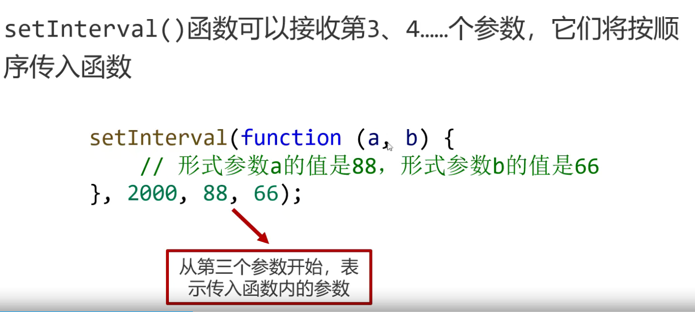

## 定时器和延时器

### 定时器

- `setInterval()`函数：可以重复调用一个函数，在每次调用之间具有具体的时间间隔

```
setInterval(function(){
  //调用
},2000); // 参数：函数，间隔时间
```



- 传入具名函数不加圆括号

#### 清除定时器

- `clearInterval()`清除一个定时器

```
var timer = setInterval(function(){},1000);
clearInterval(timer);
```

- 为了防止定时器叠加，在设置之前先清除定时器

### 延时器

- `setTimeout()`执行函数一次，不重读执行

```
setTimeout(function(){},2000);
```

### 初步认识异步语句

- 异步`asynchronous`:不会阻塞 CPU 继续执行其他语句，当异步完成时，执行回调函数（callback）

### 动画

#### 轮播图

```
  <style>
    *{
      margin: 0;
      padding: 0;
    }
   .box{
    width: 500px;
    height: 100px;
    border: 1px solid #ff6f6f;
    margin: 100px auto;
    overflow: hidden;
   }
   .box ul{
    width: 1200px;
    list-style: none;
    position: relative;
   }
   .box .sm{
    box-sizing: border-box;
    width: 100px;
    height: 100px;
    border: 1px solid #000;
    float: left;
    margin-right: 10px;
    text-align: center;
    line-height: 100px;
   }
  </style>
</head>
<body>
  <div class="box">
    <ul class="list">
      <li class="sm">1</li>
      <li class="sm">2</li>
      <li class="sm">3</li>
      <li class="sm">4</li>
      <li class="sm">5</li>
    </ul>
  </div>
 <script>
  var box = document.querySelector('.box');
  var list = document.querySelector('.list');
  list.innerHTML += list.innerHTML;
  var left = 0;

  var timer;
  function move(){
    timer = setInterval(function(){
      left-=4;
      if(left<=-550){
        left = 0;
      }
      list.style.left = left+'px';
    },20);
  }
  move();

  box.onmouseenter = function(){
    clearInterval(timer);
  }
  box.onmouseleave = function(){
    clearInterval(timer);
    move();
  }
</script>
```
