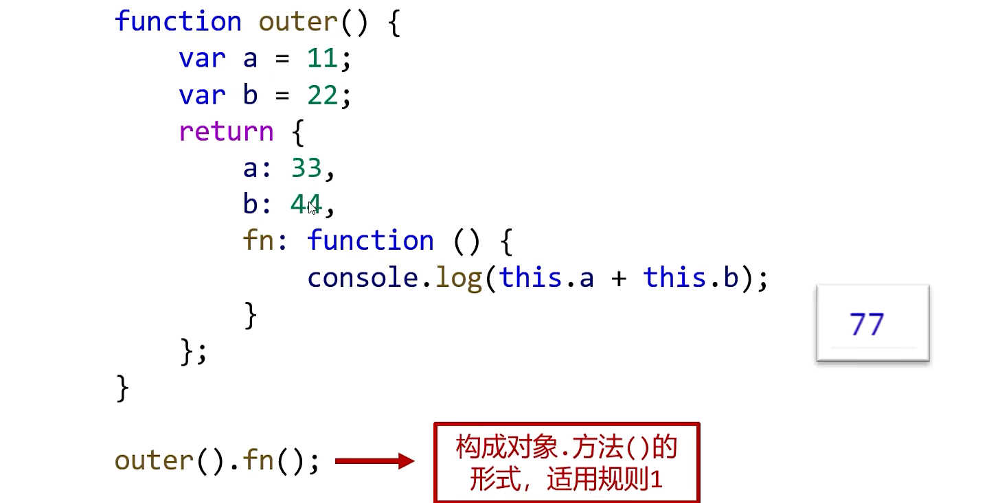

### 上下文

- 函数中可以使用 this 关键字，他表示函数的上下文
- 与中文的“这”相似，函数中的 this 具体指代什么必须通过用函数时的前言后语来判断
- 函数的上下文由调用方式决定的

1.  对象打点调用函数，函数中的 this 指向打点的对象
2.  圆括号直接调用函数，函数中的 this 指向 window 对象

```
var xiaoming = {
  nickname : 'xiao',
  age : 12,
  sayHello : function(){
    console.log('I`m '+this.nickname+',I`m '+this.age+' age')
  }
}
xiaoming.sayHello();
var sayHello = xiaoming.sayHello; // I`m xiao,I`m 12 age
sayHello(); // I`m undefined,I`m undefined age
```

#### 上下文规则 1

- 对象打点调用函数，函数中的 this 指向打点的对象

```
var obj1 ={
  a:1,
  b:2,
  fn:function(){
    console.log(this.a+this.b);
  }
};
var obj2 ={
  a:3,
  b:4,
  fn:obj1.fn
};
obj2.fn(); // 7
```




#### 上下文规则 2

- 圆括号直接调用函数，则上下文 this 是 window 对象
  

#### 上下文规则 3

- 数组（或类数组对象）枚举出函数进行调用，上下文是这个数组（或类数组对象）
  
  

#### 上下文规则 4

- IIFE 中的函数，上下文是 window 对象
  

#### 上下文规则 5

- 定时器、延时器中的函数，上下文是 window 对象
  
  

#### 上下文规则 6

- 事件处理函数的上下文是绑定事件的 DOM 元素
  
  

### call 和 apply

- call 和 apply 能指定函数的上下文


`函数.call(上下文)`和`上下文.函数()`、
`函数.apply(上下文)`和`上下文.函数()`一样

#### call 和 apply 的区别

- call 传参使用逗号，apply 使用数组


## 总结


