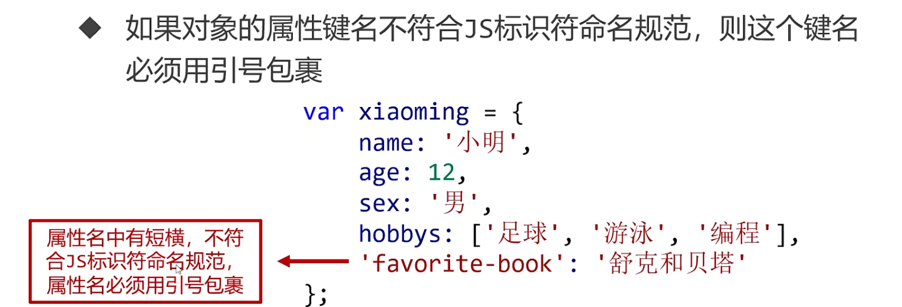
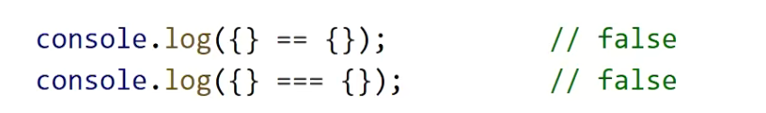
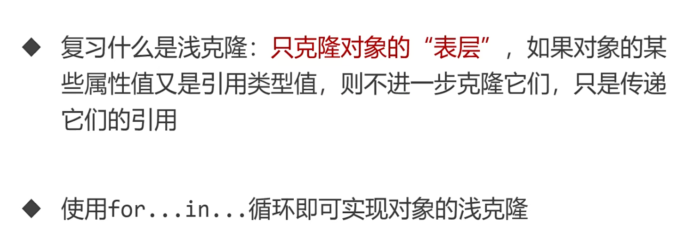
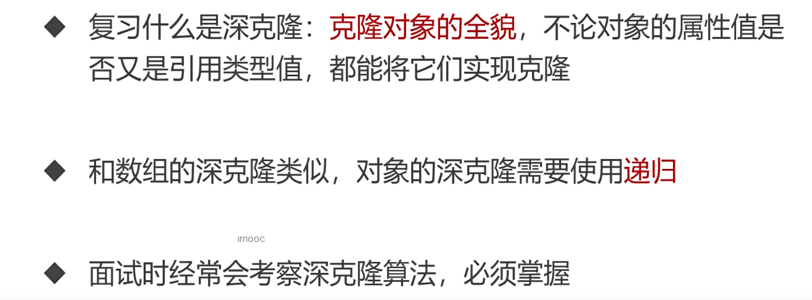

## 对象

- 对象（object）是键值对的集合，表示属性和值的映射关系



- 属性删除

```
var obj ={
  a:1,
  b:2
}
delete obj.a
```

### 对象方法

- 如果某个属性值是函数，则它也被称为对象的方法

### 对象的遍历

- `for...in..`循环，遍历对象的每个键

```
for(var k in obj){
  console.log('属性'+k+'的值是'+obj[k]);
}
```

### 对象的深浅克隆




```
// 浅克隆
var obj1={
  a:1,
  b:2,
  c:[1,2,3]
};
var obj2 = {};
for(var k in obj1){
  obj2[k] = obj1[k];
}
console.log(obj2);
```



```
// 深克隆
function fn(obj1){
  var obj2;
  if(typeof obj1 ==="object"){
    if(Array.isArray(obj1)){
      obj2 = [];
      for(var i = 0; i < obj1.length; i++){
        obj2[i] = typeof obj1[i] ==="object"? fn(obj1[i]):obj1[i];
      }
    }else{
      obj2 = {};
      for(var k in obj1){
        obj2[k] = typeof obj1[k] ==="object"? fn(obj1[k]):obj1[k];
      }
    }
  }else{
    obj2 = obj1;
  }
  return obj2;
}
```
