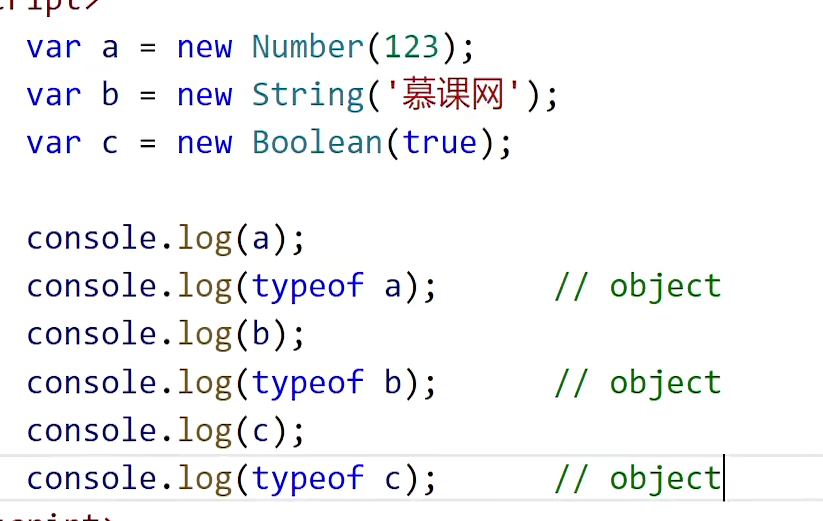
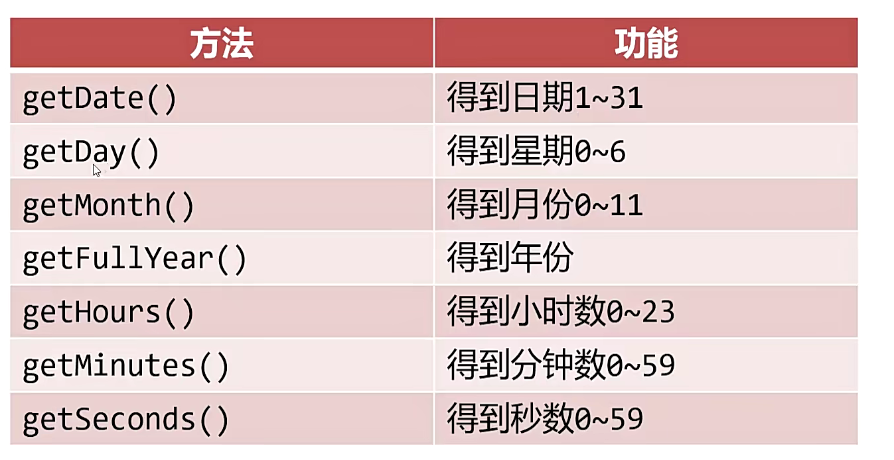
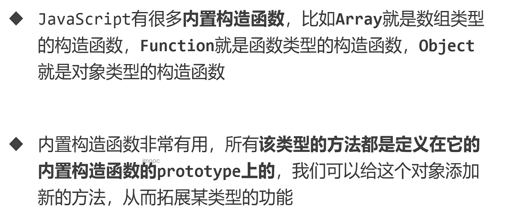

## 内置对象

### 包装类

- Number() String() Boolean() 分别使数字、字符串、布尔值的“包装类”
- 包装类的目的是为了让基本类型可以从它们的构造函数的 prototype 上获得方法



- new 出来的是包装类，变量类型是 object，但可以当作基本类型值的使用

### Math 对象

#### Math.round()四舍五入

```
var num = 3.1415926;
num = Math.round(num*100)/100; // 精确到小数点后两位
```

#### Math.max()和 Math.min()

```
console.log(Math.max(1,2,3,4)); // 4
console.log(Math.min(1,2,3,4)); // 1
console.log(Math.max.apply(null,[1,2,3,4])); // 4， ...arr将数组变成零散值
```

#### Math.random() 随机 0~1 之间的数

-`parseInt(Math.random()*(b-a+1))+a`获得 a~b 之间的整数

### Date（日期）对象

- new Date()即可得到当前事件的日期对象，它是 Object 类型值
- 使用 new Date(2020,11,1)即可得到指定日期的日期对象，第二个参数是月，从 0 开始算，11 表示 12 月
- 也可以是 new Date('2020-12-1')这种写法

#### 日期对象常见方法



```
var date = new Date('2020-12-1');
console.log(date); // Tue Dec 01 2020 00:00:00 GMT+0800 (新加坡标准时间)1
console.log(date.getDate());  // Tue Dec 01 2020 00:00:00 GMT+0800 (新加坡标准时间)
console.log(date.getDay()); // 2
console.log(date.getMonth()+1); // 12
console.log(date.getFullYear()); // 2020
console.log(date.getHours()); // 0
console.log(date.getMinutes()); // 0
console.log(date.getSeconds()); // 0
```

#### 时间戳

- 时间戳表示 1970 年 1 月 1 日零点整距某时刻的毫秒数
- 通过 getTime()方法或者 Date.parse()函数可以将时间变成时间戳
- 通过 new Date(时间戳)的写法，可以将时间戳变成日期对象

```
var date = new Date('2020-12-1');
console.log(date.getTime()); // 1606752000000
console.log(Date.parse(date)); // 1606752000000
```

#### 倒计时

```
<h1>2024高考</h1>
<h1 id="info"></h1>

 var info = document.querySelector('#info');
    setInterval(function(){
      var nd = new Date();
      var td = new Date('2024-6-7');
      // 毫秒差
      var ms = td - nd;
      var day,hour,min,sed;
      day = parseInt(ms/1000/60/60/24);
      hour = parseInt(ms/1000/60/60%24);
      min = parseInt(ms/1000/60%60);
      sed = parseInt(ms/1000%60);
      info.innerText = `距离2024高考还有${day}天，${hour}小时，${min}分，${sed}秒`
    },1000);
```

## 内置构造函数



- 任何数组字面量可以看作 Array 实例
- 任何函数字面量可以看作 Function 实例
- 任何对象字面量可以看作 Object 实例

### 扩展数组的方法
