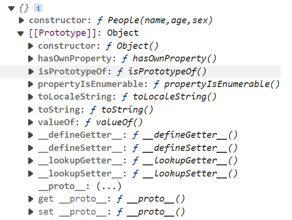
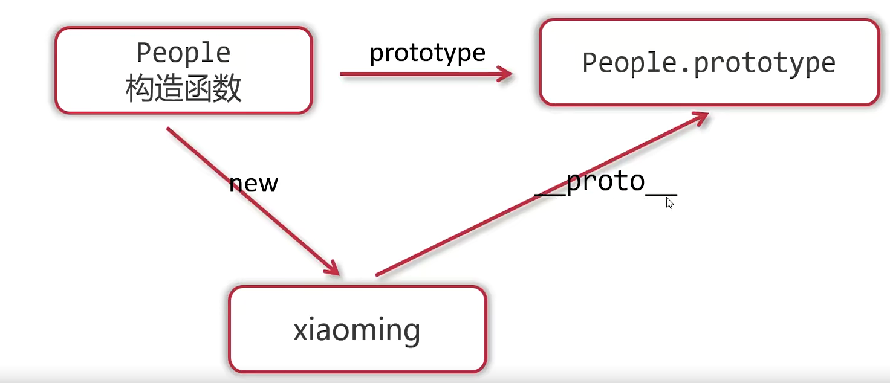
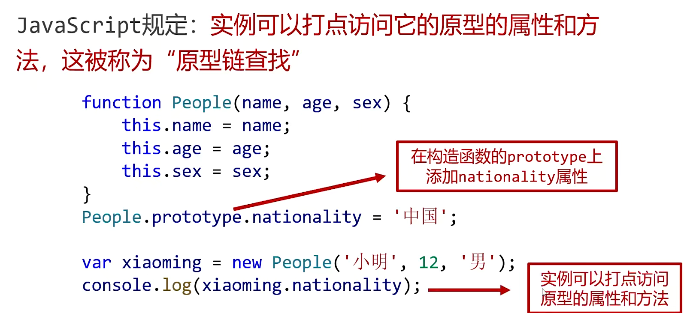
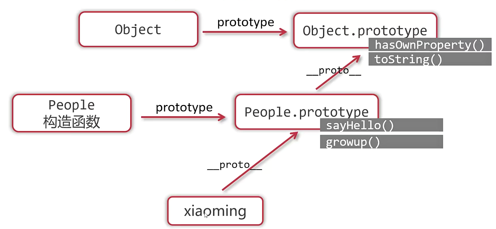
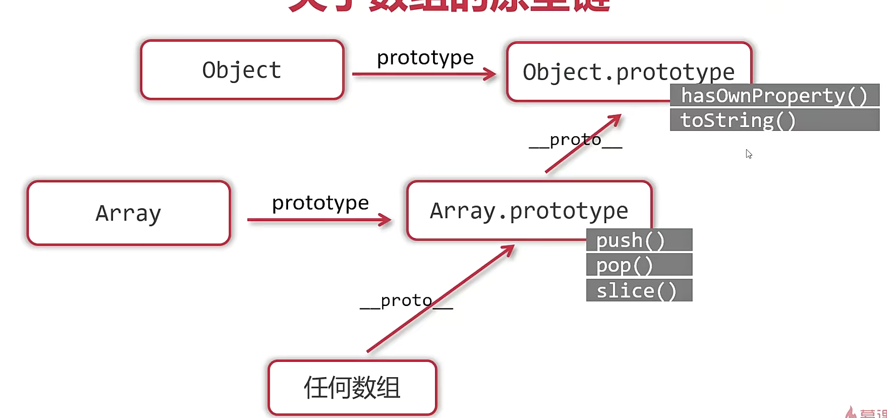
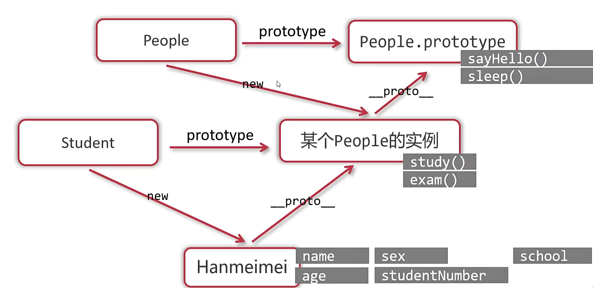

## 原型

### 什么是 prototype

- 对象天生具有 prototype 属性
- 对象.prototype 天生有 constructor 属性，指向对象本身



- 普通函数的 prototype 没有用，构造函数的 prototype 属性非常有用

#### 构造函数的 prototype

- 构造函数的 prototype 是它的实例的原型`_proto_`



- javaScript 规定：实例可以打点访问它的原型的属性和方法，这被称为原型链查找



- 实例中有点属性不会再去原型找

- `hasOwnProperty`方法可以检查对象是否真正自己拥有某属性和方法
- `in`运算符只能检查某个属性或方法是否可以被对象访问，不可以检查自己是否拥有某属性和方法`对象 in 属性/方法`

#### 在 peototype 上添加方法

- 把方法直接添加在实例上，每个实例和每个实例上的方法都是内存中不同的函数，造成了内存浪费

- 在 prototype 上添加的方法是同一个

### 原型链的终点 Object.prototype




### 继承

- 子类的 prototype 指向父类的实例
- 子类可以重写父类方法

```
    function People(name,age,sex){
      this.name = name;
      this.age = age;
      this.sex = sex;
      this.sayHello = function(){
        console.log('Hello');
      }
    }
    People.prototype.move = function(){
      console.log('move');
    }
    function Student(name,age,sex,school) {
      this.name = name;
      this.age = age;
      this.sex = sex;
      this.school = school;
    }
    Student.prototype = new People(); //继承
    Student.prototype.study = function(){
      console.log(this.name+'正在学习');
    }
    var xiaoming = new Student('xiaoming',12,'man','QH');
    xiaoming.study();
```



### 面向对象

- 面向对象的本质：定义不同的类，让类的实例工作

- 面向对象的优点：程序编写更清晰、代码结构更严密、使代码更健壮更利于维护
