## 正则表达式

- `regexp.test(str)`str 是否满足正则表达式规则

```
var str = '456789';
var regexp = /^\d{6}$/;
if(regexp.test(str)){
  alert('符合规则')
}else{
  alert('不符合规则')
}
```

- `/^m\d\d\dn$/`以字母 m 开头然后是 3 个数字，最后以字母 n 结尾

### 正则表达式的创建

#### `/内容/`的语法创建

#### `nre Regexp('内容')`的形式创建

### 元字符

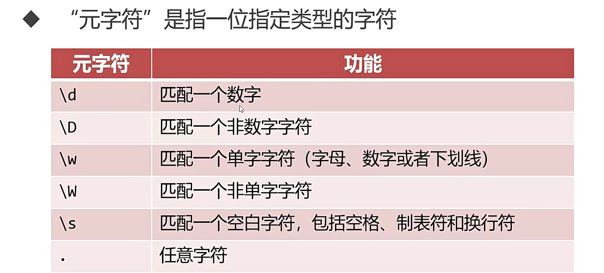
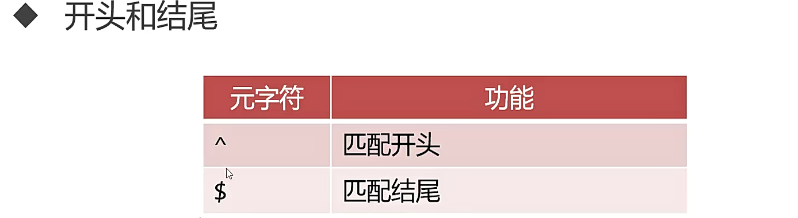

- 如果使用`new Regexp()`写法，反斜杠需要多写一个，比如`/^\d$`和`new Regexp(^\\d$)`是一个意思

```
var regexp = /^\d{3}-\d{3}-\d{3}$/;
var str = '123-456-789';
console.log(regexp.test(str)); // true

var regexp = /^\w{3}-\w{3}-\w{3}$/;
var str = '1a3-4b6-78_';
console.log(regexp.test(str)); // true
```

#### 字符转义

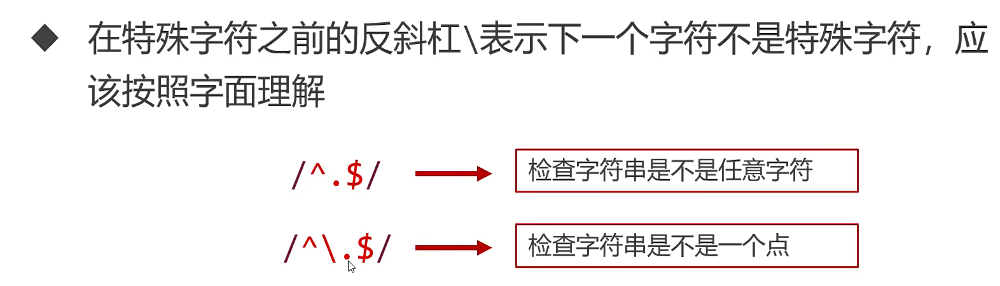
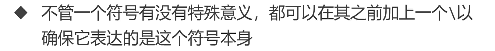

### 方括号表示法

- 使用方括号比如[xyz]，可以创建一个字符集合，表示匹配方括号中的任意字符
- [^m]表示不能是 m
  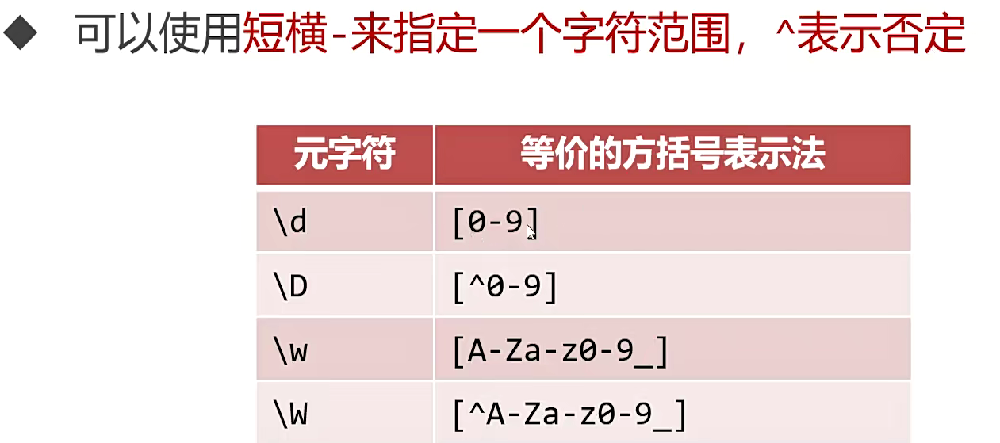

```
var regexp = /^[by]\d{7}$/; // 表示第一位是字母b或y，后面6为是数字

var regexp1 = /^[a-z.]{5}$/; // 5位字母，大小写均可
var regexp1 = /^[a-zA-z]{5}$/; // 5位字符，仅由小写字母、点构成
var regexp1 = /^[a-z]{3}[a-ln-z]$/; // 4位小写字母，最后一位不能是m字母
```

### 量词

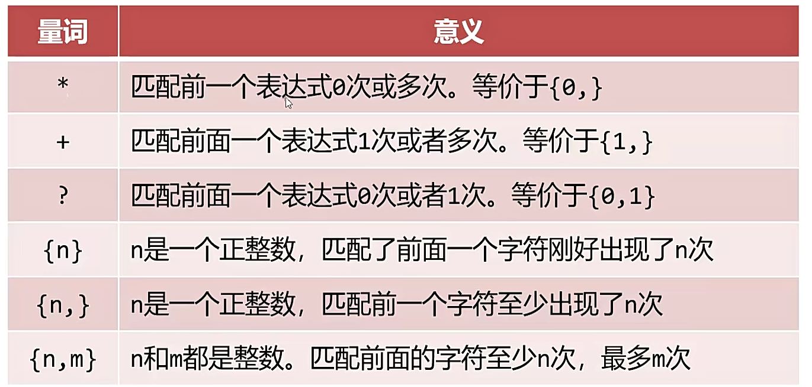
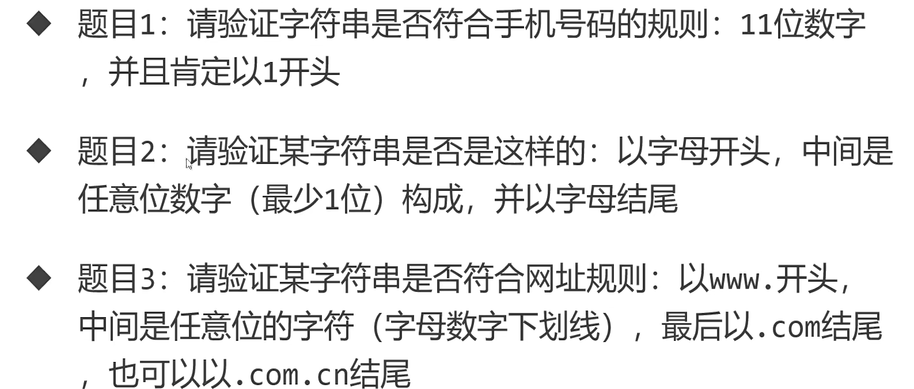

```
var regexp = /^1\d{10}$/;
var regexp = /^[a-zA-Z]\d+[a-zA-Z]$/;
var regexp = /^www\.\w*.com(.cn)?$/;
```

### 修饰符

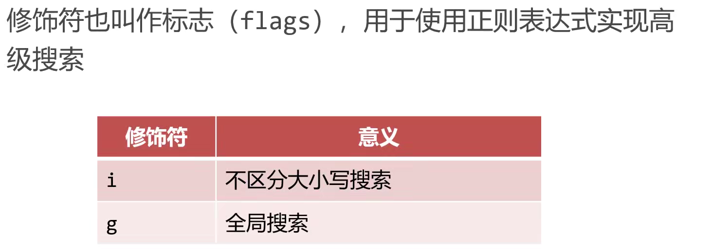
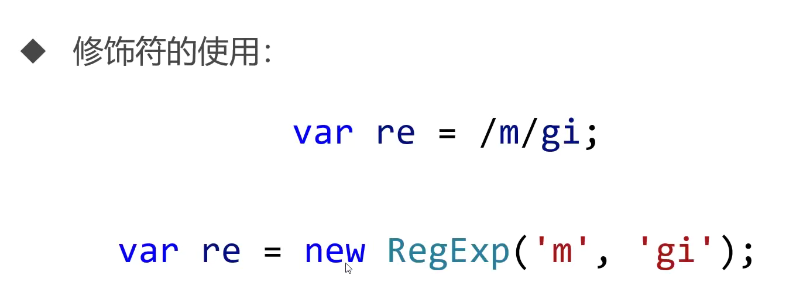

### 正则表达式相关方法

- `test()`测试某字符串是否匹配正则表达式，返回布尔值
- `exec()`根据正则表达式在字符串中进行查找，返回数组或 null

```
var regexp1 = /\d+/g;
var str = '123sdg435dg5d4'
console.log(regexp1.exec(str));
console.log(regexp1.exec(str));
console.log(regexp1.exec(str));
console.log(regexp1.exec(str));
var res;
while(res = regexp1.exec(str))console.log(res);
```

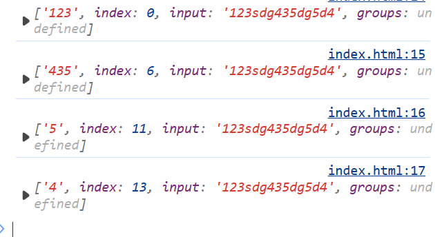

### 字符串相关方法

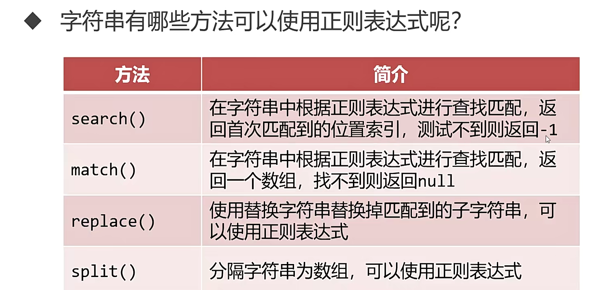

```
var str = '123sdg435dg5d4'
console.log(str.search(/\d+/)); // 0
console.log(str.match(/\d+/)); // [1,2,3]
console.log(str.split(/\d+/)); //  ['', 'sdg', 'dg', 'd', '']
console.log(str.replace(/[a-z]/g,'*')); // 123***435**5*4
```

### 正则表达式的应用

```
var nameRegexp = /^[\u4E00-\u9FA5]{2,4}$/;
var input =document.querySelector('input');
var waring = document.querySelector('.waring');
input.onblur = function(){
  var name = input.value;
  if(!nameRegexp.test(name)){
    waring.style.display = 'inline';
  }else{
    waring.style.display = 'none';
  }
}
```
