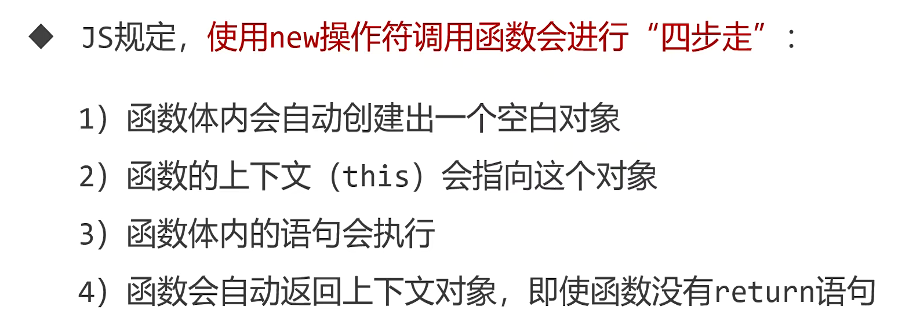

## 结构函数和类

### 用 new 操作符调用函数



```
function fn(){
  this.a=3;
  this.b=5;
}
var obj = new fn();
console.log(obj); // {a:3,b:5}
```

### 类与实例

- java 和 C++是面向对象语言
- javaScript 中的构造函数可以类比为 java 中的类

```
function People(name,age,sex){
  this.name = name;
  this.age = age;
  this.sex = sex;
  this.sayHello = function(){
    console.log('Hello');
  }
}
var xiaoming = new People('xiaoming',12,man);
var xiaohong = new People('xiaohong',13,woman);
var xiaolv = new People('xiaolv',14,man);
```
