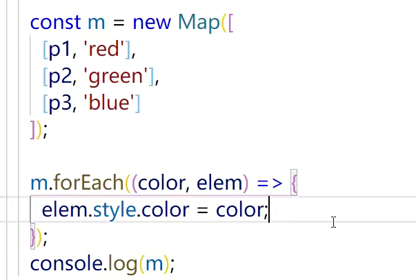

## ES6

### 剩余参数

- 剩余参数是个数组，即使没有值，也是空数组

```
const add = (x,y,z,...arr) =>{
  console.log(arguments);
}
add(1,2,3,4,5,6);
```

#### 剩余参数注意事项

1. 箭头函数的剩余参数
   > 虽然单个参数可以省略圆括号，但剩余参数不可以省略
2. 可以用剩余参数代替 arguments 获取参数
3. 剩余参数只能是最后一个参数

```
/**
    reduce() 方法是 JavaScript 数组对象的一个高阶函数，用于对数组中的每个元素执行一个指定的回调函数，并将结果累积起来。
    它接受一个回调函数作为参数，这个回调函数可以接受四个参数：accumulator（累加器）、currentValue（当前值）、currentIndex（当前索引）和array（原始数组）。
 */
const add = (...arr) => {
  return arr.reduce((sum,currentValue)=>{
    return sum + currentValue;
  },0);// 累加器初始值
}
console.log(add(1,2,3)); //6
```

4. 剩余参数结构赋值也可以使用，叫剩余元素

```
const [num,...arr] = [1,2,3,4];
console.log(num,arr);
const {x,t,...z} = {a:3,x:1,y:2,b:4};
console.log(x,y,z);// 1 2 {a:3,b:4}
```

### 数组的展开运算符

```
console.log(Math.min(...[1,2,3,4]));
```

#### 区分剩余参数和展开运算符

- 展开运算符：[3,1,2] => 3,1,2

- 剩余参数： 3,2,1 => [3,2,1]

#### 数组展开运算符的应用

- 复制数组

```
// 深拷贝
  const a = [1,2,{x:3}];
  const b = [...a]; // [1,2,3]
  a[2] = {x:4};
  console.log(a,b);
// 合并数组
  const a= [1,2];
  const b= [3,4];
  const c = [...a,...b]; // [1,2,3,4];
// 字符串转数组
   const str = 'hello';
   console.log([...str]); // ['h','e','l','l','o']
// 常见类数组转化成数组
  function func(){
    console.log([...arguments]);
  }
  conat p_list = document.querySelectorAll('p');
  console.log([...p_list]);
```

### 对象展开运算符

- 展开对象必须在{}中展开

```
 const person = {
  color: 'red',
  shape: '球形'
 };
 console.log({...person}); // 新对象，相当于复制
```

- 合并对象

```
 const apple = {
  color: 'red',
  shape: '球形'
 };
 const pen = {
  color: 'black',
  shape: '圆柱形'
 };
 console.log({...person,...pen}); //  相当于属性罗列，重复属性后面覆盖前面的
```

#### 对象展开符的注意事项

1. 空对象展开

```
console.log({...{},a:1}); // {a:1}
```

2. 非对象的展开

```
console.log({...1}); //{}
console.log({...undefined}); // {}
console.log({...'hhhh'}); // {0:'h',1:'h',2:'h'}
console.log({...[1,2,3]}); // {0:1,1:2,2:3}
```

3. 对象中的对象属性的展开，不会展开对象中的属性

```
const apple ={
  feature:{
    taste:'甜'
  },
  use:'写字'
};
console.log({...apple});// {feature:{taste:'甜'},use:'写字'}

```

#### 对象展开符的应用

1. 复制对象

```
const a = {x:1,y:2};
const b = {...a};
```

2. 用户参数和默认值

```
const person = {
  age:0,
  sex:'male'
};
const Bob = {name:'Bob',...person};

```

### Set

- Set：Set 对象是值的合集（collection）。集合（set）中的元素只会出现一次，即集合中的元素是唯一的。
- Set 是无序的

> 数组是一系列有序的数组集合

```
const s = new Set();
    s.add(1);
    s.add(2);
    s.add(1);
    console.log(s); // {1,2}
```

#### Set 的方法和实例

1. 方法

```
const s = new Set();

s.add(1).add(2); // add 添加成员

s.has(1); // 判断是否有哪个成员，true

s.delete(1); // 删除成员

s.clear(); //清空

// forEach遍历，按照成员添加进成员的顺序
s.forEach(function(val,key,set){ // set是set本身
  // Set中的key和value相同
  console.log(val);
},document);// this指向
```

2. 属性

```
console.log(s.size); // 类似length属性
```

#### Set 构造函数的参数

```
// 数组
const s = new Set([1,2,3,3]); // {1,2,3}
// 字符串，arguments、nodeList
const s = new Set('hih'); // {'h','i'}

function func(){
  return arguments;
}
const s = new Set(func(1,2,3)); // {1,2,3}

console.log(new Set(document.querySelectorAll('p'))); //{p,p,p}

const s2 = new Set(s); // {1,2,3},相当于复制
```

#### Set 注意事项

- 判断重复的方式

```
const set = new Set([1,2,1]); //[1,2]
// 大部分使用严格相等，NaN在Set中相等
```

- 什么时候用 Set

1. 数组或字符串去重时
2. 不需要小标访问，只需要遍历时
3. 为了使用 Set 提供的方法和属性时（add delete clear has forEach size）

#### Set 的应用

```
// 数组去重
let arr = [1,2,3,4,3,2,1];
let s = new Set(arr);
arr = [...s]; // [1,2,3,4]

// 字符串去重
let arr = [1,2,3,4,3,2,1];
let s = new Set(arr);
arr = [...s].join(''); // '1234'

```

### Map

- Map：映射，Map 和对象都是键值对的集合

```
const map = new Map();
map.set('name','Bob');
console.log(map); // {name:'Bob'}
```

#### Map 和对象的区别

- 对象一般用字符串当作键，map 学过的数据类型都可以当作键（[]、{}
  布尔值、undefined、null、数字、字符串、布尔值、Set、Map 等）
- 使用 set 添加成员时，键如果已存在，后添加的键值对覆盖已有的

#### Map 实例的方法和属性

1. 方法

```
const map = new Map();
m.set('age',18).set(true,'true'); // {'age':18,true,'true'}，set添加新成员

m.get('age'); // 18，获取指定成员，成员不存在时返回undefined

m.has('age'); // true，是否存在

m.delete('age'); // 删除

m.clear();  // 清除

m.forEach(function(val,key,map){ // 遍历
  console.log(map[key],val);
},document); //this指向


```

2. 属性

```
// size
map.size;
```

#### Map 构造函数的参数

```
// 只能传二维数组，而且必须体现键和值
const map = new Map([['name','Bob'],['age',18]]);

// Set,也必须体现键和值
const map = new Map(new Set([['name','Bob'],['age',18]]));

// Map
const map = new Map(new Map([['name','Bob'],['age',18]])); // 相当于复制了一个新的Map
```

#### Map 的注意事项

1. 判断键名是否相同

> 基本遵循===，但 NaN 相同

2. 什么时候使用 Map

> 键值用字符串以外的数据类型或只需要 key->value 的结构（对象没有 forEach 只有 for in）

#### Map 的应用



### 遍历

#### Iterator

1. 什么是 iterator

- iterator：遍历器（迭代器）
- for forEach for...in for..of

2. 寻找 iterator：可遍历对象，有 next 方法，返回含 value、done 属性的对象
   

```
console.log([1,2][Symbol.iterator]()); //iterator

const it = [1,2][Symbol.iterator]();
console.log(it.next()); // {value:1,done:false}
console.log(it.next()); // {value:2,done:false}
console.log(it.next()); // {value:undefined,done:true}
```

3. 为什么需要 Iterator 遍历器
   > iterator 是一个统一的遍历方式
4. 如何更方便的使用 iterator

```
// Sysmbol.iterator -> it ->next()
// 我们一般不直接使用iterator遍历，使用封装好的for……of

```

#### for...of 的用法

- 可以使用 break、continue
- arr.values()得到值的可便利对象，可遍历出值
- arr.keys()得到索引的可便利对象，可遍历出索引值
- arr.entres()得到索引+值组成的可遍历对象

```
  //  const it = [1,2][Symbol.iterator]();
  //  let next = it.next();
  //  while(!next.done){
  //   console.log(next.value); //1 2
  //   next = it.next();
  //  }
  const arr = [1,2,3];
  for(let val of arr.values()){
    console.log(val); // 1 2 3
  }
  for(let key of arr.keys()){
    console.log(key); // 0 1 2
  }
  for(let [index,val] of arr.entres()){
    console.log(index,val); // 0 1, 1 2, 2 3
  }
```

#### 原生可遍历和非原生可遍历

1. 什么可遍历

- 只要有 Symbol.iterator 方法，并且可以生成可遍历对象，就是可遍历的
- 只要可遍历，就可以使用 for……of 循环

2. 原生可遍历的有哪些

- 数组、字符串、Set、Map、arguments、NodeList

3. 非原生可便伦理的有哪些

- 一般的对象

```
const person = {name:'Bob',age:18};
person[Symbol.iterator] = ()=>{
  let index = 0;
  return {
    next(){
      idx++;
      if(index === 1){
        return {
          value:person.age,
          done:false
        };
      }else if(index === 2){
        return {
          value:person.name,
          done:false
        }
      }else{
        return {
          value:defined,
          done:true
        }
      }
    }
  }
}
```

### ES6 新增方法

#### 字符串新增方法

- includes

```
'abc'.includes('a'); // true,判断是否存在字串，返回布尔值
'abc'.includes('a',0); // 第二个参数表示开始查找的位置，默认0

```

- padStart 和 padEnd()，补全字符串长度
  > 原字符串大于补全字符串数，字符串不会变

```
let str = 'hhh';
str.padStart(5,'ab'); // 'abhhh'
str.padStart(6,'ab'); // 'abahhh'
str.padEnd(6,'ab'); // 'hhhaba'
```

- trimeStart()和 trimeEnd()，trim()清除字符串的首尾空格，一般用于表单提交

#### 数组新增方法

- includes()判断数组是否包含某个成员，indeueds 判断 NaN 相同，第二个参数表示搜索起始位置
- Array.from()1.从什么转化为数组，所有可遍历的（Set、字符串、Map、NodeList、arguments），拥有 length 属性的任意对象 2.第二个参数是一个回调 3.第三个参数，修改 this 指向，注意箭头函数没有 this

```
console.log(Array.from('str')); ['s','t','r']

let arr = [1,2];
arr.map(value)=>{
  return value*2;
}// [2,4]

Array.from('12',(val)=>val*2); // 第二个回调和map一样用法
```

- find()：找到满足条件的第一个值和 findIndex()：找到满足第一个条件值的索引

```
[1,2,10,15].find((value,index,arr)=>{
  return value>9;
}); // 10
[1,2,10,15].findIndex((value,index,arr)=>{
  return value>9;
}); // 2
```

#### 对象新增方法

- Object.assign()合并多个对象，将后面的对象合并到第一个参数中

```
  const apple = {
  color: 'red',
  shape: '球形'
  };
  const pen = {
  color: 'black',
  shape: '圆柱形'
  };
  console.log(Object.assign(apple,pen));
  const obj = {};
  console.log(Object.assign(obj,apple,pen));
```

> 注意事项：1.基本数据类型作为源对象，先转换为对象再合并 2.同名属性后面覆盖前面
> 应用：合并默认参数和用户参数`const option = Object.assign({},DFFAULTS,user)`

- Object.keys()键数组 Object.values()值数组 Object.entries()二维数组
  > 数组的 arr.keys()得到的是 iterator
- for...of 遍历对象

```
 const apple = {
  color: 'red',
  shape: '球形'
};
for( const item of apple.keys())console.log(item);
for( const [key,value] of apple.entries())console.log(key,value);
```
