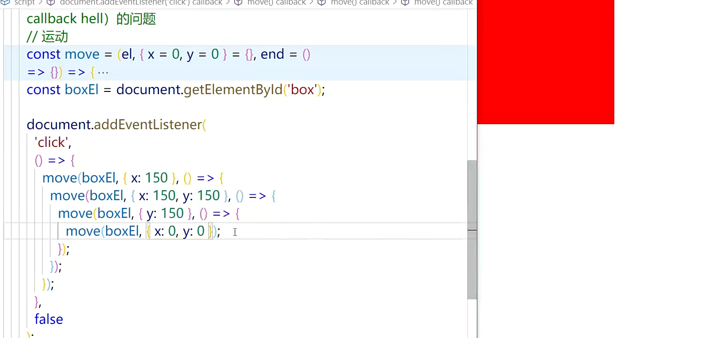

## promise

- promise：异步操作的一种解决方案，回调函数

```
document.addEventListener('click',function(){
  console.log('这是异步的');
},false);
console.log('这是同步的');
```

- promise：是解决层层嵌套的回调函数（回调地狱）
  

### promise 的基本用法

1. 实例化构造函数生成实例对象

```
const p = new Promise(()=>{});
```

2. Promise 状态

- 一开始是 padding（未完成），执行 resolve 变成 fulfilled（resolved）已成功，执行 reject 变成 rejected 已失败
- promise 的状态一旦变化，就不会再改变了

3. then 方法
4. resolve 和 reject 函数参数

```
const p = new Promise((resolve,reject)=>{
  resolve(); //正常使用
  reject(new Error()); //一般参数传错误对象
});
p.then(()=>{
  console.log('success');
},()=>{
  console.log('wraing');
})
```

### 实例方法

1. 什么时候执行

- pending -> fulfilled 执行痛恨的第一个回调函数
- pending -> rejected 执行第二个回调函数
- 谁调用谁决定回调，默认返回 undefined、fulfilled 的 Promise
- 在 then 回调函数中，return 后面的东西会用 Promise 包装

```
const p = new Promise((resolve,reject)=>{
  resolve()
})
const p2 = p.then(()=>{
  console.log('success');
},()=>{
  console.log('wraing');
}); // 返回的也是promise对象

p2.then(()=>{
  console.log('success2');
},()=>{
  console.log('wraing2');
})
```

### catch 方法

- then 一般不用第二个回调，用 catch 方法专门处理 rejected 状态
- catch 本质上是 then 的特例，可以捕获前面的错误
- 错误不会消失，直到有方法处理

```
const p = new Promise((resolve,reject)=>{
  // resolve()
  reject(new Error('出错了'));
})
const p2 = p.then(()=>{
  console.log('success');
}).then(()=>{
  // throw new Error('err');
  console.log('success2')
}).catch(err=>{
  console.log(err);
})

```

### finally()方法

- 什么时候执行，当 Promise 状态变化是不论如何变化都会执行，不变化不执行

```
const p = new Promise((resolve,reject)=>{
   resolve()
  // reject(new Error('出错了'));
})
p.finally(data=>{
  console.log(data);
})
```

- 本质：then 方法的特例

```
const p2 = p.then(()=>{
  console.log('success2')
},()=>{
  console.log('err')
}).then(data=>{
  console.log(data);
})
```

### Promise.resolve()和 Promise.reject()

#### Promise.resolve()

- 当 resolve 函数接收的时 Promise 对象时，后面的 then 会根据传递的 Promise 对象的状态变化决定执行 then 的哪一个回调

```
new Promise(resolve=>resolve('foo'));
//简写
Promise.resolve('foo');

// 一般参数
Promise.resolve('foo').then(data=>{
  console.log(data);
})

// Promise参数，当Promise.resolve()接收的是Promise对象时，直接返回这个Promise对象，什么都不做
const p1 = new Promise(resolve=>{
  setTimeout(resolve,1000,'我执行了');
  // setTimeout(()=>{
  //   resolve('我执行了');
  // },1000)
});
Promise.resolve(p1).then(data=>{
  console.log(data); // 1s后我执行了
})
// 相当于
p1.then(data=>{
  console.log(data); // 1s后我执行了
})

//具有then方法的对象,没有执行resolve或reject，状态为padding后面.then不会执行
const thenable = {
  then(){
    console.log('then');
    resolve('hhh');
    //reject();
  }
};
Promise.resolve(thable).then(
  data => console.log(data),
  err => console.log(err)
);


```

#### Promise.reject()

```
new Promise((resolve,reject)=>{
  reject('err');
})
Promise.reject('err');

// 参数,不管什么参数都会原封不动向后传递

// 中间then return data相当于return Promise.resolve(data)
```

#### Promise.all()

- 想观察多个 Promise 对象状态变化
- 所有状态都变成 resolved，最终状态才会变成 resolved
- 只要有一个变成 reject，最终状态就变成 reject

```
const delay = ms =>{
  return new Promise((resolve,reject)=>{
    setTimeout(resolve,ms)
  })
};
const p1 = delay(1000).then(()=>{
  console.log('p1完成了');
})
const p2 = delay(2000).then(()=>{
  console.log('p2完成了');
})
const p = Promise.all([p1,p2]);
p.then(data=>{
  consloe.log(data);
},err=>{
  console.log(data);
})

```

#### Promise.race()和 Promise.allSettled()

- Promise.race()：用来关注多个 Promise 对象状态
- Promise.race()状态值取决于第一个完成了的 Promise 对象，第一个成功就成功，失败就失败
- Promise.allSettled()：用来关注多个 Promise 对象状态
- Promise.allSettled()状态值永远成功，只是记录 Promise 对象

```
const delay = ms =>{
  return new Promise((resolve,reject)=>{
    setTimeout(resolve,ms)
  })
};
const p1 = delay(1000).then(()=>{
  console.log('p1完成了');
})
const p2 = delay(2000).then(()=>{
  console.log('p2完成了');
})
const p = Promise.race([p1,p2]);
p.then(data=>{
  consloe.log(data);
},err=>{
  console.log(data);
})

```

### Promise 的注意事项

- resolve 和 reject 执行后的代码
  > 正常执行，建议 resolve 和 reject 后面直接 return
- Promise.all/race/allSettled 参数问题
  > 参数如果不是 Promise 数组，会将不是 Promise 的数组元素转变为 Promise 对象，相当于 Promise.resolve(元素)
- Promise.all/race/allSettled 错误处理
  > 1.给每一个 Promise 元素单独加 catch 2.统一处理 catch

### Promise 应用

- Promise 异步加载图片

```
const imgDOM = document.querySelector('img');
const loadImgAsync = url =>{
  return new Promise((resolve,reject)=>{
    const img = new Image();
    img.src = url;
    img.onload=()=>{
      resolve(img);
    };
    img.onerror=()=>{
      reject(new Error(`Could not load image at ${url}`));
    }

  })
}

loadImgAsync('image-2.png').then(img=>{
  console.log(img);
  setTimeout(()=>{
    imgDOM.src = img.src;
  },2000);

}).catch(err=>{
  console.log(err);
})
```
