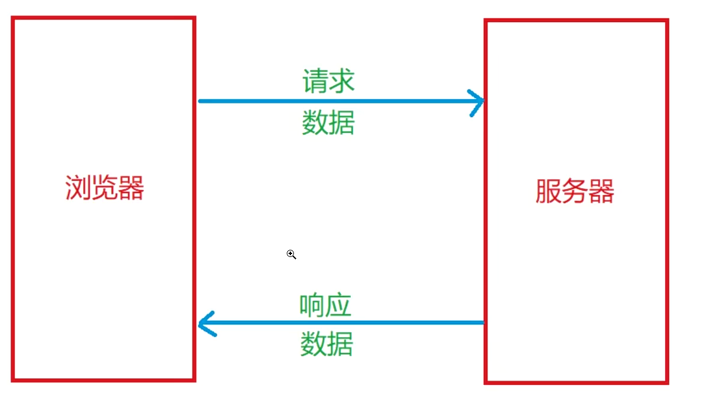
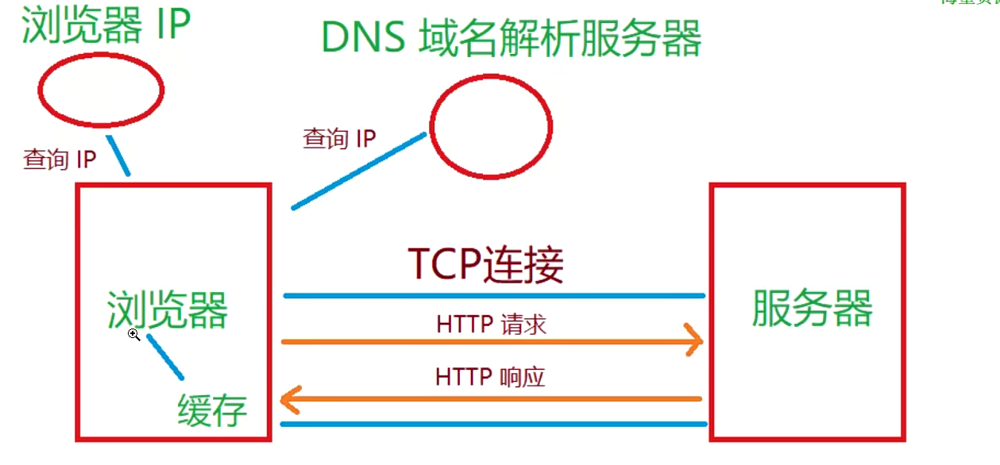
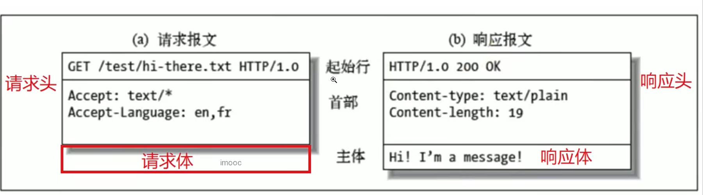

## 前后端通信

1. 前后端通信：前端（浏览器）和后端（服务器）数据交互的过程
2. 后端项前端发送数据

- 访问页面

2. 前端向后端发送数据

- 提交表单

### 前后端通信过程和概念

- 前端：浏览器端，客户端：只要能和服务器通信的都叫客户端，后端：服务器端

### 前后端通信方式

1. 使用浏览器访问页面

- 在浏览器地址栏输入网址，按下回车

2. HTML 的标签

- 浏览器在解析 HTML 标签时，遇到一些特殊的标签，会再次向服务器发送请求 link/iframe/img/script
- 还有一些标签，浏览器在解析时不会向服务器发送请求，在用户操作后发送请求 a/form

3. Ajax 和 Fetch

## HTTP 协议

- HTTP 是 HyperText Trasfer Protocol 超文本传输协议
- HTML 超文本标记语言
- 超文本：原先一个个单一的文本，通过超链接将其联系起来。由原来的单一的文本变成了可无线延伸、扩展的超级/立体文文本
- HTML、JS、CSS、图片、字体等都是通过 HTTP 在服务器和浏览器之间传输
- 每一次前后端通信前端需要主动向后端发送请求，后端接收到前端请求后，可以给出响应

### HTTP 请求响应过程

1. 查询网址 ip，第一次通过 DNS 解析服务器，后面缓存
2. 建立 TCP 连接
3. 发送 HTTP 请求

### HTTP 报文

- 当浏览器向服务器发送请求时，请求本身就是信息，叫做请求报文
- 服务器向浏览器发送响应时传输的信息，叫做响应报文

#### 报文格式

> GET 请求没有请求体，数据在请求头里
> POST 请求有请求体，数据在请求体里

- 请求头：起始行+首部
- 请求体：

- 响应头：
- 响应体：

### HTTP 方法

#### 常用的 HTTTP 方法

- 用于定义对于资源采取什么样的操作，但不是强制性的

1. GET 查

- 获取数据

2. POST 增

- 创建数据

3. PUT 改

- 更新数据

4. DELETE 删

- 删除数据

#### RESTful 请求风格

- 一种接口设计风格，充分利用 HTTP 方法的语义
- 获取数据，GET 方式
  https://www.baidu.com/api/http/getUser?id=1
- 新增数据，POST 方式
  https://www.baidu.com/api/http/addUser
- 修改数据，POST 方式
  https://www.baidu.com/api/http/modifyUser
- 删除数据，POST 方式
  https://www.baidu.com/api/http/deleteUser

- 获取数据，GET 方式
  https://www.baidu.com/api/http/user?id=1
- 新增数据，POST 方式
  https://www.baidu.com/api/http/user
- 修改数据，PUT 方式
  https://www.baidu.com/api/http/user
- 修改数据，DELETE 方式
  https://www.baidu.com/api/http/user

#### GET 和 POST 方法对比

1. 语义

- get 获取数据，post 创建数据

2. 发送数据

- get 在请求头中携带数据，一般最多几 k
- post 可以在请求头和请求体中携带数据，理论上是无限的

3. 缓存

- 地址是可以被缓存的
- get 可以被缓存
- post 不可以缓存

4. 安全性

- get 和 post 都不安全
- 发送密码或其他敏感信息是不要使用 GET，主要是避免直接被他人窥屏或通过历史记录找到你的密码

### HTTP 状态码

- 状态码：定义服务器对请求的处理结果

#### HTTP 状态码语义

- 100~199：代表请求被接受了，需要继续处理，在 websocket 时使用
- 200~299：成功
- 300~399：重定向，将老的网址重定向到新网址
- 301 Moved Permanently 永久移动
- 302 Move Temporaily 临时跳转
- 304 Not Modified 文件未修改
- 400~404：请求错误
- 404 Not Found
- 500~599 服务器错误
- 500 Internal Server Error
