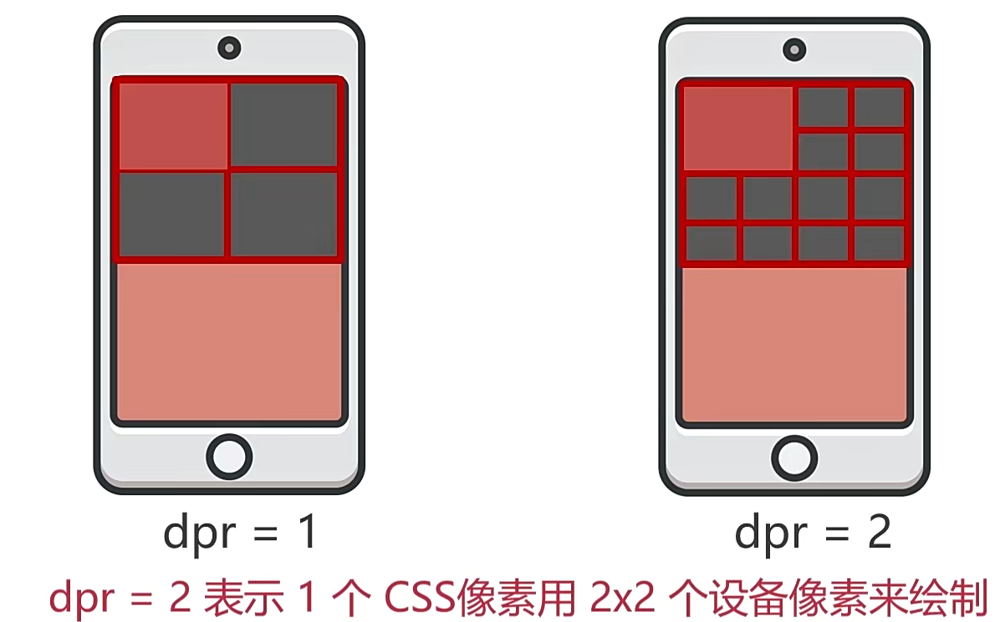
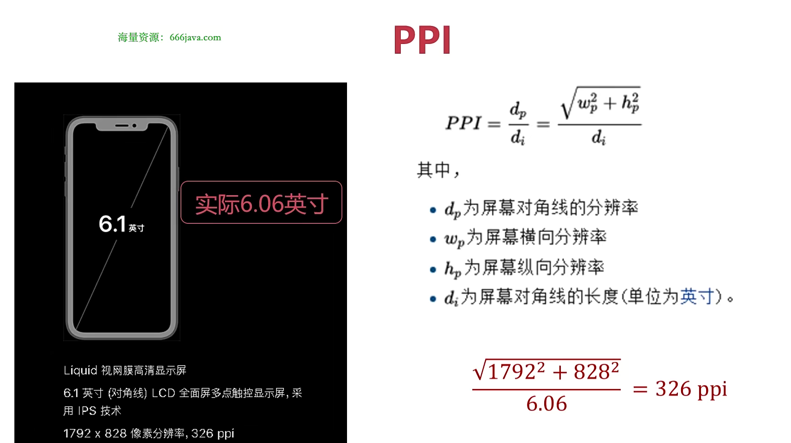

## 移动端

### 移动 Web 开发入门

#### 分辨率

#### 物理像素（设备像素）

- 手机上一个个点

#### CSS 像素（逻辑像素、设备独立像素）

- 实际开发中使用的像素，css 像素会自动换算为对应的物理像素

#### 设备像素比

- dpr =（在同一个方向上）设备像素/css 像素（没有缩放时）
  

#### 标清屏和高清屏

- dpr=1，dpr>1

#### 缩放

- 用户通过手指放大或缩小屏幕
- 缩放改变的是 CSS 像素的大小

#### PPI

- 每英寸的物理像素点 dpi/ppi
  

### 视口--viewport

- 我们需要移动端访问页面
- 布局视口=视觉视口时，就是理想视口

#### 如何设置 viewport

```
<!-- width=device-width布局视口等于视觉视口，initial-scale=1初始缩放比为1，user-scalabel=no禁止用户缩放，maximum-scale=1，minimum-scale=1 -->
  <meta name="viewport" content="width=device-width, initial-scale=1.0, user-scalbel=no">
```

#### 获取视口宽度

- 两个都是布局视口

```
console.log(document.documentElement.clientWidth);
console.log(document.documentElement.getBoundingClientRect().width);
```

#### 真机查看

1. 本地服务器查看
2. 关闭防火墙，手机在浏览器中输入网址

#### 开发中常用单位

1. px

- 当需要固定宽高时使用，也可设置字体大小

2. %

- 相对单位，可以用来设置宽度，流体布局时可能用到

3. em

- 设置字体大小时，1em 等于父元素字体大小
- 设置其他，比如宽高，1e=自身字体大小
- 一般用于设置缩进 text-indent=2em

4. rem（root element html）

- 相对 html 根元素字体大小

```
html{
  font-size: 12px;
}
```

5. vw/wh/vmax/vmin

- 相对视口百分比
  // 1vw=视口宽度 1%
  // 1vh=视口高度 1%
  // vmax：当前 vw 和 vh 中较小的一个值
  // vmin：当前 vw 和 vh 中较大的一个值

## 移动端布局

```
/* 多行文字省略 */
  overflow: hidden;
  text-overflow: ellipsis;
  -webkit-line-clamp: 2;
  -webkit-box-orient: vertical;
  white-space: normal !important;
  word-wrap: break-word;
```

### 固定宽度布局（PC 端常用布局）

### 流体布局（百分比布局）

### Flex 弹性布局（工具）

#### Flex 基础知识

- Flex 布局：Flexible Box 缩写，弹性布局
- Flex 容器：采用 Flex 布局的元素
- Flex 项目：Flex 容器的所有子元素自动成为容器成员，称为 Flex 项目
- 默认情况下水平方向是主轴，垂直与主轴的方向是交叉轴
- Flex 项目默认沿主轴起始排列

```
/* Flex容器是块级元素 */
display: flex;

/* Flex容器是内联元素 */
display: inline-flex;

/* 改变主轴方向 */
flex-direction: column;
```

#### Flex 容器属性

1. flex-direction 主轴方向
   > row(默认) colmun row-revers column-revers
2. flex-wrap 跨行
   > nowrap(默认) wrap
3. flex-flow 上面两种简写
   > row wrap(默认)
4. justify-content 主轴对其方式
   > flex-start(默认) flex-end center space-between 项目之间间隔 space-around 两侧相对
5. align-items 没有设置交叉轴方向大小将占满整个容器交叉轴方向大小，设置交叉轴对齐方向
   > stretch(默认) flex-start flex-end center baseline 基线对齐
6. align-content 存在多根主轴线时，Flex 项目在交叉轴上方向对齐方式
   > stretch(默认)

#### Flex 项目属性

1. order

- 定义 Flex 项目排列顺序，数值越小越靠前，默认为 0

2. flex-frow
3. flex-shrink
4. flex-basis
5. flex 包括前面三个
6. align-self

### rem 和 vm 布局

### 响应式布局

### Grid 网格布局（工具）
